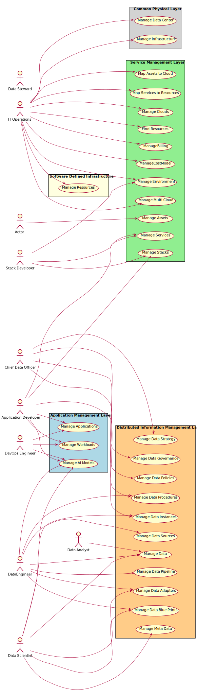

# Actors

* [Actor](actor-actor) - Long description Continued on next line
* [Application Developer](actor-applicationdeveloper) - Long description Continued on next line
* [Chief Data Officer](actor-cdo) - Long description Continued on next line
* [Data Analyst](actor-analyst) - Long description Continued on next line
* [DataEngineer](actor-dataengineer) - Long description Continued on next line
* [Data Scientist](actor-datascientist) - Long description Continued on next line
* [Data Steward](actor-datasteward) - Long description Continued on next line
* [DevOps Engineer](actor-devops) - Long description Continued on next line
* [IT Operations](actor-itops) - Long description Continued on next line
* [Stack Developer](actor-stackdev) - Long description Continued on next line

