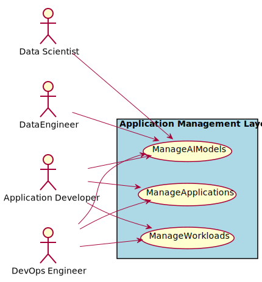
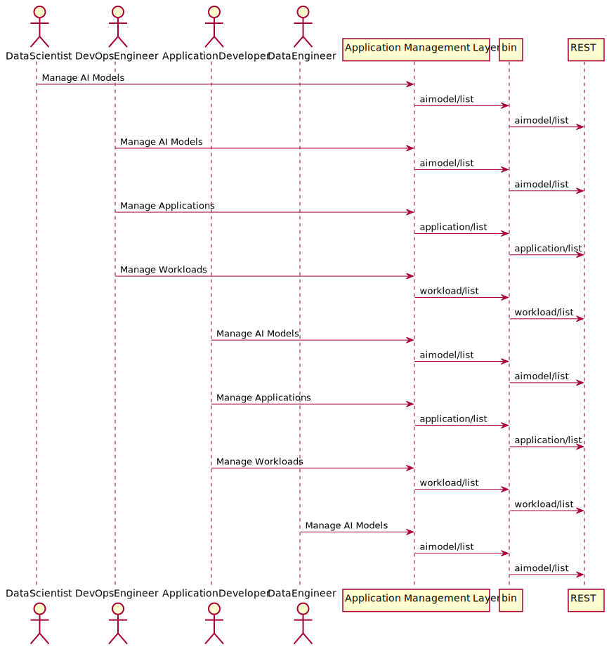
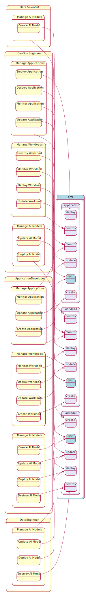
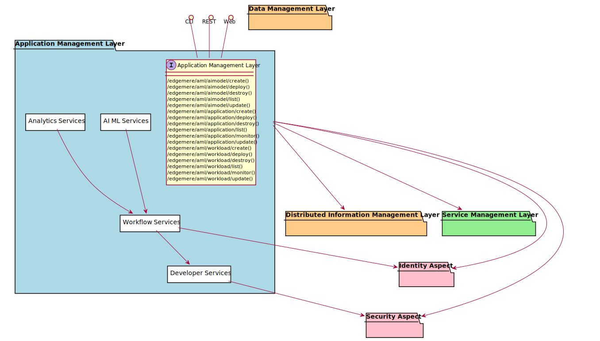
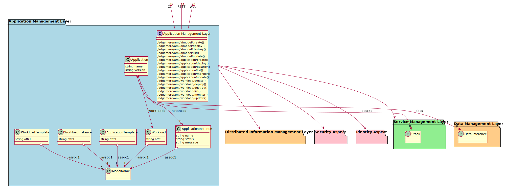

# Application Management Layer

Application Management Layer is responsible for the management of applications and workflows andthe development, test, deployment and updates of those applications and workloads

The Application Management Layer (AML) contains abstractions that help App Development,
DevOps, and IT Operations manage complex workflows and applications through the application
development lifecycle. The AML sits at the top of the system stack and communicates directly with
the [Distributed Information Management Layer](package--edgemere-dml) and the
[Service Management Layer](package--edgemere-sml). It also leverages the
[Identity Aspect](package--edgemere-ia) and [Security Aspect](package--edgemere-sa) layers.

The AML contains for sub packages that group common off the shelf tools integrated together.
In the Analytics Services package common tools for analytics can be found including collection,
analytics and insight. AI/ML Services represent the myrid of tools and services that focus
on Artificial Intelligence and Machine Learning algorithms, and solutions.

These two packages take advantage of the application and workflow services which allow
these solutions to be orchestrated at the highest level of integration by providing a
framework and common definition framework to show how these applications and workflow
interact.

There are several tool suites that have been built to aid SecDevOps. These tools are
grouped together in the SecDevOps Services and include Automation Frameworks (Salt,Chef,
puppet, ansible), CICD tools (Gitlab, GitHub, Jenkins, etc...) and Environment Management.

## Use Cases

The following are the use cases of the Application Management Layer subsystem. Each use case has primary and secondary scenarios
that are elaborated in the use case descriptions.

* [Manage AI Models](usecase-ManageAIModels)
* [Manage Applications](usecase-ManageApplications)
* [Manage Workloads](usecase-ManageWorkloads)

## Users

The following are the actors of the Application Management Layer subsystem. This can include people, other subsystems 
inside the solution and even external subsystems. 

* [DataScientist](actor-datascientist)
* [DevOpsEngineer](actor-devops)
* [ApplicationDeveloper](actor-applicationdeveloper)
* [DataEngineer](actor-dataengineer)

## Interface

The subsystem has a REST, CLI, WebSocket, and Web interface. Use Cases and Scenarios can use any or all
of the interfaces to perform the work that needs to be completed. The following  diagram shows how
users interact with the system.

* [ edgemere aml aimodel create](#action--edgemere-aml-aimodel-create)
* [ edgemere aml aimodel deploy](#action--edgemere-aml-aimodel-deploy)
* [ edgemere aml aimodel destroy](#action--edgemere-aml-aimodel-destroy)
* [ edgemere aml aimodel list](#action--edgemere-aml-aimodel-list)
* [ edgemere aml aimodel update](#action--edgemere-aml-aimodel-update)
* [ edgemere aml application create](#action--edgemere-aml-application-create)
* [ edgemere aml application deploy](#action--edgemere-aml-application-deploy)
* [ edgemere aml application destroy](#action--edgemere-aml-application-destroy)
* [ edgemere aml application list](#action--edgemere-aml-application-list)
* [ edgemere aml application monitor](#action--edgemere-aml-application-monitor)
* [ edgemere aml application update](#action--edgemere-aml-application-update)
* [ edgemere aml workload create](#action--edgemere-aml-workload-create)
* [ edgemere aml workload deploy](#action--edgemere-aml-workload-deploy)
* [ edgemere aml workload destroy](#action--edgemere-aml-workload-destroy)
* [ edgemere aml workload list](#action--edgemere-aml-workload-list)
* [ edgemere aml workload monitor](#action--edgemere-aml-workload-monitor)
* [ edgemere aml workload update](#action--edgemere-aml-workload-update)

## Logical Artifacts

The Data Model for the  Application Management Layer subsystem shows how the different objects and classes of object interact
and their structure.

### Sub Packages

The Application Management Layer subsystem has sub packages as well. These subsystems are logical components to better
organize the architecture and make it easier to analyze, understand, design, and implement.

* [AI ML Services](package--edgemere-aml-ams)
* [Analytics Services](package--edgemere-aml-as)
* [Developer Services](package--edgemere-aml-ds)
* [Workflow Services](package--edgemere-aml-ws)

### Classes

The following are the classes in the data model of the Application Management Layer subsystem.

* [Application](class-Application)
* [ApplicationInstance](class-ApplicationInstance)
* [ApplicationTemplate](class-ApplicationTemplate)
* [Workload](class-Workload)
* [WorkloadInstance](class-WorkloadInstance)
* [WorkloadTemplate](class-WorkloadTemplate)

## Deployment Architecture

This subsystem is deployed using micro-services as shown in the diagram below. The 'micro' module is
used to implement the micro-services in the system. The subsystem also has an CLI, REST and Web Interface
exposed through a nodejs application. The nodejs application will interface with the micro-services and
can monitor and drive work-flows through the mesh of micro-services. The deployment of the subsystem is 
dependent on the environment it is deployed. This subsystem has the following environments:
* [dev](environment--edgemere-aml-dev)
* [test](environment--edgemere-aml-test)
* [prod](environment--edgemere-aml-prod)

## Physical Architecture

The Application Management Layer subsystem is physically laid out on a hybrid cloud infrastructure. Each microservice belongs
to a secure micro-segmented network. All of the micro-services communicate to each other and the main app through a
REST interface. A Command Line Interface (CLI), REST or Web User interface for the app is how other subsystems or actors 
interact. Requests are forwarded to micro-services through the REST interface of each micro-service. The subsystem has
the a unique layout based on the environment the physical space. The following are the environments for this
subsystems.
* [dev](environment--edgemere-aml-dev)
* [test](environment--edgemere-aml-test)
* [prod](environment--edgemere-aml-prod)

## Micro-Services

These are the micro-services for the subsystem. The combination of the micro-services help implement
the subsystem's logic.

### dev

Detail information for the [dev environment](environment--edgemere-aml-dev)
can be found [here](environment--edgemere-aml-dev)

Services in the dev environment

* frontend : aml_web
* gw : aml_gw

### test

Detail information for the [test environment](environment--edgemere-aml-test)
can be found [here](environment--edgemere-aml-test)

Services in the test environment

* frontend : aml_web
* gw : aml_gw

### prod

Detail information for the [prod environment](environment--edgemere-aml-prod)
can be found [here](environment--edgemere-aml-prod)

Services in the prod environment

* frontend : aml_web
* gw : aml_gw

## Activities and Flows
The Application Management Layer subsystem provides the following activities and flows that help satisfy the use
cases and scenarios of the subsystem.

### Messages Sent

TBD

## Interface Details
The Application Management Layer subsystem has a well defined interface. This interface can be accessed using a
command line interface (CLI), REST interface, and Web user interface. This interface is how all other
subsystems and actors can access the system.

### Action  edgemere aml aimodel create

* REST - /edgemere/aml/aimodel/create
* bin -  edgemere aml aimodel create
* js - .edgemere.aml.aimodel.create

Description of the action

| Name | Type | Required | Description |
|---|---|---|---|
| attr1 | string |false | Description for the parameter |

### Action  edgemere aml aimodel deploy

* REST - /edgemere/aml/aimodel/deploy
* bin -  edgemere aml aimodel deploy
* js - .edgemere.aml.aimodel.deploy

Description of the action

| Name | Type | Required | Description |
|---|---|---|---|
| attr1 | string |false | Description for the parameter |

### Action  edgemere aml aimodel destroy

* REST - /edgemere/aml/aimodel/destroy
* bin -  edgemere aml aimodel destroy
* js - .edgemere.aml.aimodel.destroy

Description of the action

| Name | Type | Required | Description |
|---|---|---|---|
| attr1 | string |false | Description for the parameter |

### Action  edgemere aml aimodel list

* REST - /edgemere/aml/aimodel/list
* bin -  edgemere aml aimodel list
* js - .edgemere.aml.aimodel.list

Description of the action

| Name | Type | Required | Description |
|---|---|---|---|
| attr1 | string |false | Description for the parameter |

### Action  edgemere aml aimodel update

* REST - /edgemere/aml/aimodel/update
* bin -  edgemere aml aimodel update
* js - .edgemere.aml.aimodel.update

Description of the action

| Name | Type | Required | Description |
|---|---|---|---|
| attr1 | string |false | Description for the parameter |

### Action  edgemere aml application create

* REST - /edgemere/aml/application/create
* bin -  edgemere aml application create
* js - .edgemere.aml.application.create

Description of the action

| Name | Type | Required | Description |
|---|---|---|---|
| attr1 | string |false | Description for the parameter |

### Action  edgemere aml application deploy

* REST - /edgemere/aml/application/deploy
* bin -  edgemere aml application deploy
* js - .edgemere.aml.application.deploy

Description of the action

| Name | Type | Required | Description |
|---|---|---|---|
| attr1 | string |false | Description for the parameter |

### Action  edgemere aml application destroy

* REST - /edgemere/aml/application/destroy
* bin -  edgemere aml application destroy
* js - .edgemere.aml.application.destroy

Description of the action

| Name | Type | Required | Description |
|---|---|---|---|
| attr1 | string |false | Description for the parameter |

### Action  edgemere aml application list

* REST - /edgemere/aml/application/list
* bin -  edgemere aml application list
* js - .edgemere.aml.application.list

Description of the action

| Name | Type | Required | Description |
|---|---|---|---|
| attr1 | string |false | Description for the parameter |

### Action  edgemere aml application monitor

* REST - /edgemere/aml/application/monitor
* bin -  edgemere aml application monitor
* js - .edgemere.aml.application.monitor

Description of the action

| Name | Type | Required | Description |
|---|---|---|---|
| attr1 | string |false | Description for the parameter |

### Action  edgemere aml application update

* REST - /edgemere/aml/application/update
* bin -  edgemere aml application update
* js - .edgemere.aml.application.update

Description of the action

| Name | Type | Required | Description |
|---|---|---|---|
| attr1 | string |false | Description for the parameter |

### Action  edgemere aml workload create

* REST - /edgemere/aml/workload/create
* bin -  edgemere aml workload create
* js - .edgemere.aml.workload.create

Description of the action

| Name | Type | Required | Description |
|---|---|---|---|
| attr1 | string |false | Description for the parameter |

### Action  edgemere aml workload deploy

* REST - /edgemere/aml/workload/deploy
* bin -  edgemere aml workload deploy
* js - .edgemere.aml.workload.deploy

Description of the action

| Name | Type | Required | Description |
|---|---|---|---|
| attr1 | string |false | Description for the parameter |

### Action  edgemere aml workload destroy

* REST - /edgemere/aml/workload/destroy
* bin -  edgemere aml workload destroy
* js - .edgemere.aml.workload.destroy

Description of the action

| Name | Type | Required | Description |
|---|---|---|---|
| attr1 | string |false | Description for the parameter |

### Action  edgemere aml workload list

* REST - /edgemere/aml/workload/list
* bin -  edgemere aml workload list
* js - .edgemere.aml.workload.list

Description of the action

| Name | Type | Required | Description |
|---|---|---|---|
| attr1 | string |false | Description for the parameter |

### Action  edgemere aml workload monitor

* REST - /edgemere/aml/workload/monitor
* bin -  edgemere aml workload monitor
* js - .edgemere.aml.workload.monitor

Description of the action

| Name | Type | Required | Description |
|---|---|---|---|
| attr1 | string |false | Description for the parameter |

### Action  edgemere aml workload update

* REST - /edgemere/aml/workload/update
* bin -  edgemere aml workload update
* js - .edgemere.aml.workload.update

Description of the action

| Name | Type | Required | Description |
|---|---|---|---|
| attr1 | string |false | Description for the parameter |

