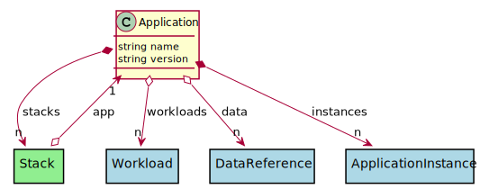

# Application

Description long description

## Attributes

* name:string - Name of the Application
* version:string - Version of the Application

## Associations

| Name | Cardinality | Class | Composition | Owner | Description |
| --- | --- | --- | --- | --- | --- |
| workloads | n | Workload | false | false |  |
| stacks | n | Stack | true | true |  |
| data | n | DataReference | false | false |  |
| instances | n | ApplicationInstance | true | true |  |

## Users of the Model

| Name | Cardinality | Class | Composition | Owner | Description |
| --- | --- | --- | --- | --- | --- |
| app | 1 | Stack | false | false | Applications of the stacks |

## Methods

<h2>Method Details</h2>
    

