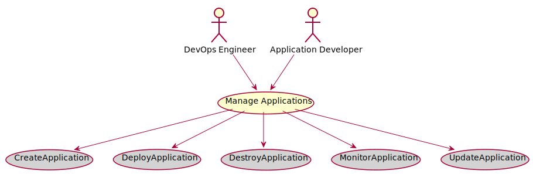

# Manage Applications

DevOps Engineers and Application Developers need the ability to manage applications across multiple environments, clouds, and types of infrastructure.

## Actors

* [DevOps Engineer](actor-devops)
* [Application Developer](actor-applicationdeveloper)

## Detail Scenarios

* [Manage Applications](#scenario-CreateApplication)
* [Manage Applications](#scenario-DeployApplication)
* [Manage Applications](#scenario-DestroyApplication)
* [Manage Applications](#scenario-MonitorApplication)
* [Manage Applications](#scenario-UpdateApplication)

  
### Scenario Create Application

Create Application is the description

#### Steps

1. To Be Defined

#### Actors

* [Application Developer](actor-applicationdeveloper)

### Scenario Deploy Application

Deploy Application is the description

#### Steps

1. To Be Defined

#### Actors

* [DevOps Engineer](actor-devops)

### Scenario Destroy Application

Destroy Application is the description

#### Steps

1. To Be Defined

#### Actors

* [DevOps Engineer](actor-devops)

### Scenario Monitor Application

Monitor Application is the description

#### Steps

1. To Be Defined

#### Actors

* [DevOps Engineer](actor-devops)
* [Application Developer](actor-applicationdeveloper)

### Scenario Update Application

Update Application is the description

#### Steps

1. To Be Defined

#### Actors

* [Application Developer](actor-applicationdeveloper)
* [DevOps Engineer](actor-devops)

