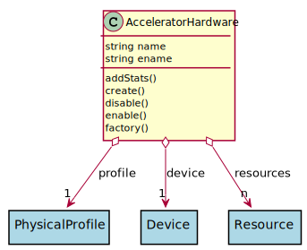

# AcceleratorHardware

Represents Hardware that is an accelerator

## Attributes

* name:string - Name of the hardware
* ename:string - Extended Name of the hardware

## Associations

| Name | Cardinality | Class | Composition | Owner | Description |
| --- | --- | --- | --- | --- | --- |
| profile | 1 | PhysicalProfile | true |  |  |
| device | 1 | Device | false | false |  |
| resources | n | Resource | false | false |  |

## Users of the Model

| Name | Cardinality | Class | Composition | Owner | Description |
| --- | --- | --- | --- | --- | --- |

## Methods

* [addStats() - Add Stats to the Hardware](#Action-addStats)

* [create() - Create Hardware](#Action-create)

* [disable() - Disable Device and its hardware](#Action-disable)

* [enable() - Enable Device to be used.](#Action-enable)

* [factory() - Create Hardware based on properties](#Action-factory)

<h2>Method Details</h2>
    
### acceleratorhardware.addStats
* REST - acceleratorhardware/addStats
* bin - acceleratorhardware addStats
* js - acceleratorhardware.addStats

Add Stats to the Hardware

| Name | Type | Required | Description |
|---|---|---|---|
| stats | json |true | Object Map of the stats |

### acceleratorhardware.create
* REST - acceleratorhardware/create
* bin - acceleratorhardware create
* js - acceleratorhardware.create

Create Hardware

| Name | Type | Required | Description |
|---|---|---|---|
| name | string |true | name of the hardware |
| capabilities | json |true | capabilities of the hardware |

### acceleratorhardware.disable
* REST - acceleratorhardware/disable
* bin - acceleratorhardware disable
* js - acceleratorhardware.disable

Disable Device and its hardware

| Name | Type | Required | Description |
|---|---|---|---|

### acceleratorhardware.enable
* REST - acceleratorhardware/enable
* bin - acceleratorhardware enable
* js - acceleratorhardware.enable

Enable Device to be used.

| Name | Type | Required | Description |
|---|---|---|---|

### acceleratorhardware.factory
* REST - acceleratorhardware/factory
* bin - acceleratorhardware factory
* js - acceleratorhardware.factory

Create Hardware based on properties

| Name | Type | Required | Description |
|---|---|---|---|
| name | string |true | name of the hardware |
| type | string |true | type of the hardware |
| capabilities | json |true | definition of the hardware |

