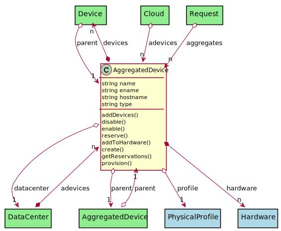
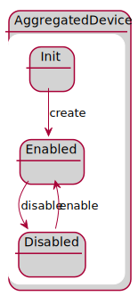

# AggregatedDevice

This is a construct that has other devices under it

## Attributes

* name:string - Name of the aggregated device
* ename:string - Extended name of the aggregated device
* hostname:string - Hostname of the device
* type:string - Type of the Device

## Associations

| Name | Cardinality | Class | Composition | Owner | Description |
| --- | --- | --- | --- | --- | --- |
| devices | n | Device | false | true |  |
| profile | 1 | PhysicalProfile | true |  |  |
| datacenter | 1 | DataCenter | false | false |  |
| hardware | n | Hardware | false | true |  |
| parent | 1 | AggregatedDevice | false | false |  |

## Users of the Model

| Name | Cardinality | Class | Composition | Owner | Description |
| --- | --- | --- | --- | --- | --- |
| parent | 1 | Device | false | false |  |
| parent | 1 | AggregatedDevice | false | false |  |
| adevices | n | DataCenter | false | true |  |
| adevices | n | Cloud | false | false |  |
| aggregates | n | Request | false | false |  |

## State Net

| Name | Description | Events |
| --- | --- | --- |
| Init |  | create-&gt;Enabled,  |
| Enabled |  | disable-&gt;Disabled,  |
| Disabled |  | enable-&gt;Enabled,  |

## Methods

* [addDevices() - Add Devices to the Aggregated Device](#action-addDevices)

* [disable() - Disable Device and its hardware](#action-disable)

* [enable() - Enable Device to be used.](#action-enable)

* [reserve() - Reserve a resource](#action-reserve)

* [addToHardware() - Create a Device](#action-addToHardware)

* [create() - Create a Device](#action-create)

* [getReservations() - Get reservation from the requirements](#action-getReservations)

* [provision() - Provision Hardware to meet the requirements](#action-provision)

<h2>Method Details</h2>
    
### Action aggregateddevice addDevices

* REST - aggregateddevice/addDevices
* bin - aggregateddevice addDevices
* js - aggregateddevice.addDevices

Add Devices to the Aggregated Device

| Name | Type | Required | Description |
|---|---|---|---|
| item | object |true | Devices to add to the Aggregated Device |

### Action aggregateddevice disable

* REST - aggregateddevice/disable
* bin - aggregateddevice disable
* js - aggregateddevice.disable

Disable Device and its hardware

| Name | Type | Required | Description |
|---|---|---|---|

### Action aggregateddevice enable

* REST - aggregateddevice/enable
* bin - aggregateddevice enable
* js - aggregateddevice.enable

Enable Device to be used.

| Name | Type | Required | Description |
|---|---|---|---|

### Action aggregateddevice reserve

* REST - aggregateddevice/reserve
* bin - aggregateddevice reserve
* js - aggregateddevice.reserve

Reserve a resource

| Name | Type | Required | Description |
|---|---|---|---|
| request | object |true | Request for the reservation |

### Action aggregateddevice addToHardware

* REST - aggregateddevice/addToHardware
* bin - aggregateddevice addToHardware
* js - aggregateddevice.addToHardware

Create a Device

| Name | Type | Required | Description |
|---|---|---|---|

### Action aggregateddevice create

* REST - aggregateddevice/create
* bin - aggregateddevice create
* js - aggregateddevice.create

Create a Device

| Name | Type | Required | Description |
|---|---|---|---|
| name | string |true | name of the device |
| file | YAML |false | file with the definition |

### Action aggregateddevice getReservations

* REST - aggregateddevice/getReservations
* bin - aggregateddevice getReservations
* js - aggregateddevice.getReservations

Get reservation from the requirements

| Name | Type | Required | Description |
|---|---|---|---|
| requirements | YAML |true | Requirements for the Reservation |

### Action aggregateddevice provision

* REST - aggregateddevice/provision
* bin - aggregateddevice provision
* js - aggregateddevice.provision

Provision Hardware to meet the requirements

| Name | Type | Required | Description |
|---|---|---|---|
| requirements | json |true | Requirements for the Provision |

