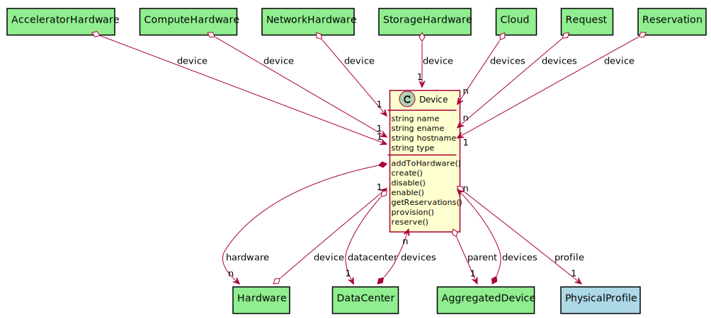
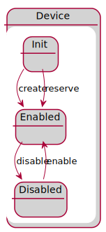

# Device

Representation of a device in a datacenter

## Attributes

* name:string - Name of the device
* ename:string - Extended Name of the device
* hostname:string - Hostname of the device
* type:string - Type of the Device

## Associations

| Name | Cardinality | Class | Composition | Owner | Description |
| --- | --- | --- | --- | --- | --- |
| profile | 1 | PhysicalProfile | true |  |  |
| hardware | n | Hardware | false | true |  |
| datacenter | 1 | DataCenter | false | false |  |
| parent | 1 | AggregatedDevice | false | false |  |

## Users of the Model

| Name | Cardinality | Class | Composition | Owner | Description |
| --- | --- | --- | --- | --- | --- |
| devices | n | AggregatedDevice | false | true |  |
| device | 1 | AcceleratorHardware | false | false |  |
| device | 1 | ComputeHardware | false | false |  |
| devices | n | DataCenter | false | true |  |
| device | 1 | Hardware | false | false |  |
| device | 1 | NetworkHardware | false | false |  |
| device | 1 | StorageHardware | false | false |  |
| devices | n | Cloud | false | false |  |
| devices | n | Request | false | false |  |
| device | 1 | Reservation | false | false |  |

## State Net

| Name | Description | Events |
| --- | --- | --- |
| Init |  | create-&gt;Enabled, reserve-&gt;Enabled,  |
| Enabled |  | disable-&gt;Disabled,  |
| Disabled |  | enable-&gt;Enabled,  |

## Methods

* [addToHardware() - Create a Device](#Action-addToHardware)

* [create() - Create a Device](#Action-create)

* [disable() - Disable Device and its hardware](#Action-disable)

* [enable() - Enable Device to be used.](#Action-enable)

* [getReservations() - Get reservation from the requirements](#Action-getReservations)

* [provision() - Provision Hardware to meet the requirements](#Action-provision)

* [reserve() - Reserve a resource](#Action-reserve)

<h2>Method Details</h2>
    
### device.addToHardware
* REST - device/addToHardware
* bin - device addToHardware
* js - device.addToHardware

Create a Device

| Name | Type | Required | Description |
|---|---|---|---|

### device.create
* REST - device/create
* bin - device create
* js - device.create

Create a Device

| Name | Type | Required | Description |
|---|---|---|---|
| name | string |true | name of the device |
| file | YAML |false | file with the definition |

### device.disable
* REST - device/disable
* bin - device disable
* js - device.disable

Disable Device and its hardware

| Name | Type | Required | Description |
|---|---|---|---|

### device.enable
* REST - device/enable
* bin - device enable
* js - device.enable

Enable Device to be used.

| Name | Type | Required | Description |
|---|---|---|---|

### device.getReservations
* REST - device/getReservations
* bin - device getReservations
* js - device.getReservations

Get reservation from the requirements

| Name | Type | Required | Description |
|---|---|---|---|
| requirements | YAML |true | Requirements for the Reservation |

### device.provision
* REST - device/provision
* bin - device provision
* js - device.provision

Provision Hardware to meet the requirements

| Name | Type | Required | Description |
|---|---|---|---|
| requirements | json |true | Requirements for the Provision |

### device.reserve
* REST - device/reserve
* bin - device reserve
* js - device.reserve

Reserve a resource

| Name | Type | Required | Description |
|---|---|---|---|
| request | object |true | Request for the reservation |

