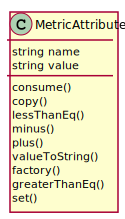

# MetricAttribute

Attribute type of Metric. This is for metrics that are descriptiive not consumable

## Attributes

* name:string - This is the name of the metric
* value:string - This is the value of the metric

## Associations

| Name | Cardinality | Class | Composition | Owner | Description |
| --- | --- | --- | --- | --- | --- |

## Users of the Model

| Name | Cardinality | Class | Composition | Owner | Description |
| --- | --- | --- | --- | --- | --- |

## Methods

* [consume() - Consume attribute metric to the current value](#Action-consume)

* [copy() - Copy Metric](#Action-copy)

* [lessThanEq() - Test less than or equal to the value passed in](#Action-lessThanEq)

* [minus() - Add attribute metric to the current value](#Action-minus)

* [plus() - Add attribute metric to the current value](#Action-plus)

* [valueToString() - Change to string Metric Consumeable](#Action-valueToString)

* [factory() - Create a metric based on the metrictype table](#Action-factory)

* [greaterThanEq() - Test greater than or equal to the value passed in](#Action-greaterThanEq)

* [set() - Add value to a metric](#Action-set)

<h2>Method Details</h2>
    
### metricattribute.consume
* REST - metricattribute/consume
* bin - metricattribute consume
* js - metricattribute.consume

Consume attribute metric to the current value

| Name | Type | Required | Description |
|---|---|---|---|
| value | object |true | Value to add to the metric |

### metricattribute.copy
* REST - metricattribute/copy
* bin - metricattribute copy
* js - metricattribute.copy

Copy Metric

| Name | Type | Required | Description |
|---|---|---|---|

### metricattribute.lessThanEq
* REST - metricattribute/lessThanEq
* bin - metricattribute lessThanEq
* js - metricattribute.lessThanEq

Test less than or equal to the value passed in

| Name | Type | Required | Description |
|---|---|---|---|
| value | object |true | Value to test against the metric |

### metricattribute.minus
* REST - metricattribute/minus
* bin - metricattribute minus
* js - metricattribute.minus

Add attribute metric to the current value

| Name | Type | Required | Description |
|---|---|---|---|
| value | object |true | Value to add to the metric |

### metricattribute.plus
* REST - metricattribute/plus
* bin - metricattribute plus
* js - metricattribute.plus

Add attribute metric to the current value

| Name | Type | Required | Description |
|---|---|---|---|
| value | object |true | Value to add to the metric |

### metricattribute.valueToString
* REST - metricattribute/valueToString
* bin - metricattribute valueToString
* js - metricattribute.valueToString

Change to string Metric Consumeable

| Name | Type | Required | Description |
|---|---|---|---|

### metricattribute.factory
* REST - metricattribute/factory
* bin - metricattribute factory
* js - metricattribute.factory

Create a metric based on the metrictype table

| Name | Type | Required | Description |
|---|---|---|---|
| name | string |true | name of the metric |
| value | json |true | value of the metric |

### metricattribute.greaterThanEq
* REST - metricattribute/greaterThanEq
* bin - metricattribute greaterThanEq
* js - metricattribute.greaterThanEq

Test greater than or equal to the value passed in

| Name | Type | Required | Description |
|---|---|---|---|
| value | object |true | Value to test against the metric |

### metricattribute.set
* REST - metricattribute/set
* bin - metricattribute set
* js - metricattribute.set

Add value to a metric

| Name | Type | Required | Description |
|---|---|---|---|
| value | number |true | Value to add to the metric |

