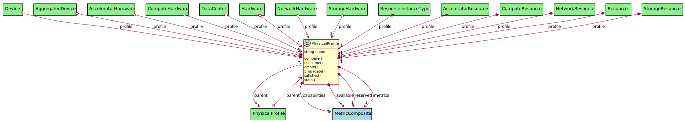

# PhysicalProfile

The Physical Profile contains the capabilities, availability, reserves andmetrics of the element in the physical domain

## Attributes

* name:string - This is the name of the Physical Profile

## Associations

| Name | Cardinality | Class | Composition | Owner | Description |
| --- | --- | --- | --- | --- | --- |
| capabilities | 1 | MetricComposite |  | true | Capabilities of the element |
| available | 1 | MetricComposite |  | true | Availability of the element |
| reserved | 1 | MetricComposite |  | true | Reservations of the element |
| metrics | 1 | MetricComposite |  | true | Metrics of the element |
| parent | 1 | PhysicalProfile |  | false | Parent of the profile for propagation |

## Users of the Model

| Name | Cardinality | Class | Composition | Owner | Description |
| --- | --- | --- | --- | --- | --- |
| profile | 1 | Device | true |  |  |
| profile | 1 | AggregatedDevice | true |  |  |
| parent | 1 | PhysicalProfile |  | false | Parent of the profile for propagation |
| profile | 1 | AcceleratorHardware | true |  |  |
| profile | 1 | ComputeHardware | true |  |  |
| profile | 1 | DataCenter | true |  |  |
| profile | 1 | Hardware | true |  |  |
| profile | 1 | NetworkHardware | true |  |  |
| profile | 1 | StorageHardware | true |  |  |
| profile | 1 | ResourceInstanceType | true | true |  |
| profile | 1 | AcceleratorResource | true | true |  |
| profile | 1 | ComputeResource | true | true |  |
| profile | 1 | NetworkResource | true | true |  |
| profile | 1 | Resource | true | true |  |
| profile | 1 | StorageResource | true | true |  |

## Methods

* [combine() - Combine Physical Profile](#Action-combine)

* [consume() - Consume the requirements, part or all of the requirements](#Action-consume)

* [create() - Create Physical Profile](#Action-create)

* [propagate() - Propagate Physical Profile](#Action-propagate)

* [satisfies() - Satisfies the requirements, part or all of the requirements](#Action-satisfies)

* [stats() - get the Stats for the physical profile](#Action-stats)

<h2>Method Details</h2>
    
### physicalprofile.combine
* REST - physicalprofile/combine
* bin - physicalprofile combine
* js - physicalprofile.combine

Combine Physical Profile

| Name | Type | Required | Description |
|---|---|---|---|
| profile | object |true | Profile to add to the current profile |

### physicalprofile.consume
* REST - physicalprofile/consume
* bin - physicalprofile consume
* js - physicalprofile.consume

Consume the requirements, part or all of the requirements

| Name | Type | Required | Description |
|---|---|---|---|
| request | object |true | Requirements to satisfy |

### physicalprofile.create
* REST - physicalprofile/create
* bin - physicalprofile create
* js - physicalprofile.create

Create Physical Profile

| Name | Type | Required | Description |
|---|---|---|---|
| parent | object |false | Parent to add to the current profile |

### physicalprofile.propagate
* REST - physicalprofile/propagate
* bin - physicalprofile propagate
* js - physicalprofile.propagate

Propagate Physical Profile

| Name | Type | Required | Description |
|---|---|---|---|
| assoc | string |true | Association to propagate |
| operation | string |true | Operation to propagate |
| value | string |true | Value to proagate |

### physicalprofile.satisfies
* REST - physicalprofile/satisfies
* bin - physicalprofile satisfies
* js - physicalprofile.satisfies

Satisfies the requirements, part or all of the requirements

| Name | Type | Required | Description |
|---|---|---|---|
| request | object |true | Requirements to satisfy |

### physicalprofile.stats
* REST - physicalprofile/stats
* bin - physicalprofile stats
* js - physicalprofile.stats

get the Stats for the physical profile

| Name | Type | Required | Description |
|---|---|---|---|

