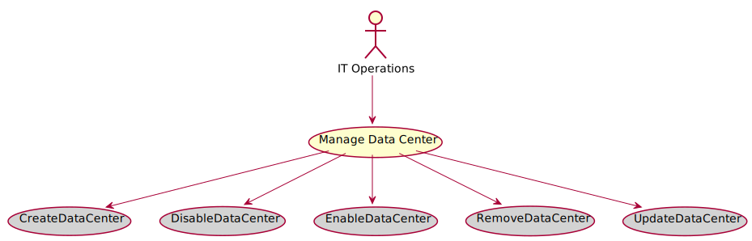

# Manage Data Center

IT Operations manages data centers by creating, deleting, enabling and disabling devicesand aggregated devices

## Actors

* [IT Operations](/actors/ITOperations/index.md)

## Detail Scenarios
* [Manage Data Center](#Scenario-CreateDataCenter)
* [Manage Data Center](#Scenario-DisableDataCenter)
* [Manage Data Center](#Scenario-EnableDataCenter)
* [Manage Data Center](#Scenario-RemoveDataCenter)
* [Manage Data Center](#Scenario-UpdateDataCenter)

  
### Scenario Create Data Center

IT Operator creates data centers and allows them to add devices and aggregated devices

#### Steps

1. [device create --name host1 --file ./templates/device.yaml](doc/action/device/create)

1. [device create --name host2 --file ./templates/device.yaml](doc/action/device/create)

1. [device create --name host3 --file ./templates/device.yaml](doc/action/device/create)

1. [device create --name host4 --file ./templates/device.yaml](doc/action/device/create)

1. [device create --name host5 --file ./templates/device.yaml](doc/action/device/create)

1. [aggregateddevice create --name ad1](doc/action/aggregateddevice/create)

1. [aggregateddevice create --name ad2](doc/action/aggregateddevice/create)

1. [aggregateddevice adddevices --name ad1 --items host1,host2](doc/action/aggregateddevice/adddevices)

1. [aggregateddevice adddevices --name ad2 --items host3,host4](doc/action/aggregateddevice/adddevices)

1. [datacenter create --name dc1](doc/action/datacenter/create)

1. [datacenter adddevices --name dc1 --items host1,host2](doc/action/datacenter/adddevices)

1. [datacenter adddevices --name dc1 --items ad2](doc/action/datacenter/adddevices)

1. [datacenter disable --name dc1](doc/action/datacenter/disable)

1. [datacenter enable --name dc1](doc/action/datacenter/enable)

#### Actors

* [IT Operations](actors/itops/index.md)

### Scenario Disable Data Center

IT Operations can disable a data center that will disable all of the devices in the data center. This can be used to test business continuity, move data center devices or decomission a data center.

#### Steps

1. [device create --name host1 --file ./templates/device.yaml](doc/action/device/create)

1. [device create --name host2 --file ./templates/device.yaml](doc/action/device/create)

1. [datacenter create --name dc1](doc/action/datacenter/create)

1. [datacenter adddevices --name dc1 --items host1,host2](doc/action/datacenter/adddevices)

1. [datacenter disable --name dc1](doc/action/datacenter/disable)

#### Actors

* [IT Operations](actors/itops/index.md)

### Scenario Enable Data Center

IT Operations can enable a data center that has been disabled

#### Steps

1. [device create --name host1 --file ./templates/device.yaml](doc/action/device/create)

1. [device create --name host2 --file ./templates/device.yaml](doc/action/device/create)

1. [datacenter create --name dc1](doc/action/datacenter/create)

1. [datacenter adddevices --name dc1 --items host1,host2](doc/action/datacenter/adddevices)

1. [datacenter disable --name dc1](doc/action/datacenter/disable)

1. [datacenter enable --name dc1](doc/action/datacenter/enable)

#### Actors

* [IT Operations](actors/itops/index.md)

### Scenario Remove Data Center

IT Operations can remove a Data Center and all of its devices and aggregated devices

#### Steps

1. [device create --name host1 --file ./templates/device.yaml](doc/action/device/create)

1. [device create --name host2 --file ./templates/device.yaml](doc/action/device/create)

1. [device create --name host3 --file ./templates/device.yaml](doc/action/device/create)

1. [device create --name host4 --file ./templates/device.yaml](doc/action/device/create)

1. [device create --name host5 --file ./templates/device.yaml](doc/action/device/create)

1. [aggregateddevice create --name ad1](doc/action/aggregateddevice/create)

1. [aggregateddevice adddevices --name ad2 --items host3,host4](doc/action/aggregateddevice/adddevices)

1. [datacenter create --name dc1](doc/action/datacenter/create)

1. [datacenter adddevices --name dc1 --items host1,host2](doc/action/datacenter/adddevices)

1. [datacenter adddevices --name dc1 --items ad1](doc/action/datacenter/adddevices)

1. [datacenter destroy --name dc1](doc/action/datacenter/destroy)

#### Actors

* [IT Operations](actors/itops/index.md)

### Scenario Update Data Center

IT Operations updates data center characteristics

#### Steps

1. [device create --name host1 --file ./templates/device.yaml](doc/action/device/create)

1. [device create --name host2 --file ./templates/device.yaml](doc/action/device/create)

1. [device create --name host3 --file ./templates/device.yaml](doc/action/device/create)

1. [device create --name host4 --file ./templates/device.yaml](doc/action/device/create)

1. [device create --name host5 --file ./templates/device.yaml](doc/action/device/create)

1. [aggregateddevice create --name ad1](doc/action/aggregateddevice/create)

1. [aggregateddevice adddevices --name ad2 --items host3,host4](doc/action/aggregateddevice/adddevices)

1. [datacenter create --name dc1](doc/action/datacenter/create)

1. [datacenter adddevices --name dc1 --items host1,host2](doc/action/datacenter/adddevices)

1. [datacenter adddevices --name dc1 --items ad1](doc/action/datacenter/adddevices)

#### Actors

* [IT Operations](actors/itops/index.md)

