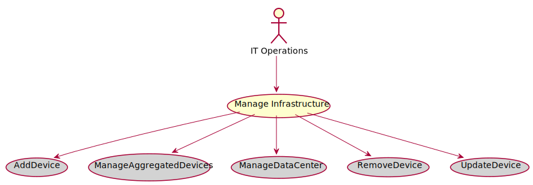

# Manage Infrastructure

Manage Infrastructure is the description

## Actors

* [IT Operations](/actors/ITOperations/index.md)

## Detail Scenarios
* [Manage Infrastructure](#Scenario-AddDevice)
* [Manage Infrastructure](#Scenario-ManageAggregatedDevices)
* [Manage Infrastructure](#Scenario-ManageDataCenter)
* [Manage Infrastructure](#Scenario-RemoveDevice)
* [Manage Infrastructure](#Scenario-UpdateDevice)

  
### Scenario Add Device

Add Device is the description

#### Steps

1. [device create --name hostad1 --file ./templates/device.yaml](doc/action/device/create)

1. [cpl device/disable --name hostad1](doc/action/cpl/device/disable)

1. [cpl device/enable --name hostad1](doc/action/cpl/device/enable)

1. [cpl device/disable --name hostad1](doc/action/cpl/device/disable)

#### Actors

* [IT Operations](actors/itops/index.md)

### Scenario Manage Aggregated Devices

Manage Aggregated Devices is the description

#### Steps

1. [device create --name hostmad1 --file ./templates/device.yaml](doc/action/device/create)

1. [device create --name hostmad2 --file ./templates/device.yaml](doc/action/device/create)

1. [device create --name hostmad3 --file ./templates/device.yaml](doc/action/device/create)

1. [aggregateddevice create --name admad1](doc/action/aggregateddevice/create)

1. [aggregateddevice adddevices --name ad1 --items hostmad1,hostmad2,hostmad3](doc/action/aggregateddevice/adddevices)

#### Actors

* [IT Operations](actors/itops/index.md)

### Scenario Manage Data Center

Manage Data Center is the description

#### Steps

1. [device create --name hostmdc1 --file ./templates/device.yaml](doc/action/device/create)

1. [device create --name hostmdc2 --file ./templates/device.yaml](doc/action/device/create)

1. [device create --name hostmdc3 --file ./templates/device.yaml](doc/action/device/create)

1. [device create --name hostmdc4 --file ./templates/device.yaml](doc/action/device/create)

1. [device create --name hostmdc5 --file ./templates/device.yaml](doc/action/device/create)

1. [aggregateddevice create --name admdc1](doc/action/aggregateddevice/create)

1. [aggregateddevice create --name admdc2](doc/action/aggregateddevice/create)

1. [aggregateddevice adddevices --name admdc1 --items hostmdc1,hostmdc2](doc/action/aggregateddevice/adddevices)

1. [aggregateddevice adddevices --name admdc2 --items hostmdc3,hostmdc4](doc/action/aggregateddevice/adddevices)

1. [datacenter create --name dcmdc1](doc/action/datacenter/create)

1. [datacenter adddevices --name dcmdc1 --items hostmdc1,hostmdc2](doc/action/datacenter/adddevices)

1. [datacenter adddevices --name dcmdc1 --items admdc2](doc/action/datacenter/adddevices)

1. [datacenter disable --name dcmdc1](doc/action/datacenter/disable)

1. [datacenter enable --name dcmdc1](doc/action/datacenter/enable)

#### Actors

* [IT Operations](actors/itops/index.md)

### Scenario Remove Device

Remove Device is the description

#### Steps

1. To Be Defined

#### Actors

* [IT Operations](actors/itops/index.md)

### Scenario Update Device

Update Device is the description

#### Steps

1. To Be Defined

#### Actors

* [IT Operations](actors/itops/index.md)

