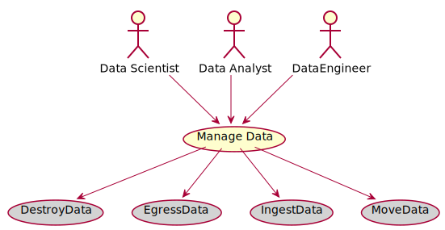

# Manage Data

Manage Data is the description

## Actors

* [Data Scientist](/actors/DataScientist/index.md)
* [Data Analyst](/actors/DataAnalyst/index.md)
* [DataEngineer](/actors/DataEngineer/index.md)

## Detail Scenarios
* [Manage Data](#Scenario-DestroyData)
* [Manage Data](#Scenario-EgressData)
* [Manage Data](#Scenario-IngestData)
* [Manage Data](#Scenario-MoveData)

  
### Scenario Destroy Data

Destroy Data is the description

#### Steps

1. To Be Defined

#### Actors

* [Actor](actors/actor/index.md)

### Scenario Egress Data

Egress Data is the description

#### Steps

1. To Be Defined

#### Actors

* [Actor](actors/actor/index.md)

### Scenario Ingest Data

Ingest Data is the description

#### Steps

1. To Be Defined

#### Actors

* [Actor](actors/actor/index.md)

### Scenario Move Data

Move Data is the description

#### Steps

1. To Be Defined

#### Actors

* [Actor](actors/actor/index.md)

