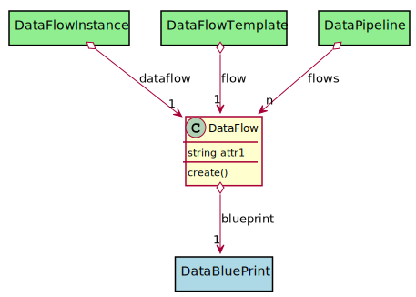

# DataFlow

Description long description

## Attributes

* attr1:string - description long description

## Associations

| Name | Cardinality | Class | Composition | Owner | Description |
| --- | --- | --- | --- | --- | --- |
| blueprint | 1 | DataBluePrint | false | false |  |

## Users of the Model

| Name | Cardinality | Class | Composition | Owner | Description |
| --- | --- | --- | --- | --- | --- |
| dataflow | 1 | DataFlowInstance | false | false |  |
| flow | 1 | DataFlowTemplate | false | false |  |
| flows | n | DataPipeline | false | false |  |

## Methods

* [create() - Create a Data Flow](#Action-create)

<h2>Method Details</h2>
    
### dataflow.create
* REST - dataflow/create
* bin - dataflow create
* js - dataflow.create

Create a Data Flow

| Name | Type | Required | Description |
|---|---|---|---|
| name | string |true | name of the data flow |
| file | YAML |false | file with the definition |

