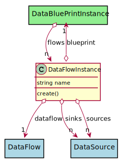

# DataFlowInstance

This is an instance of the data flow when a blue print is instantiated.

## Attributes

* name:string - Name of the Data Flow Instance

## Associations

| Name | Cardinality | Class | Composition | Owner | Description |
| --- | --- | --- | --- | --- | --- |
| blueprint | 1 | DataBluePrintInstance | false | false |  |
| dataflow | 1 | DataFlow | false | false |  |
| sinks | n | DataSource | false | false |  |
| sources | n | DataSource | false | false |  |

## Users of the Model

| Name | Cardinality | Class | Composition | Owner | Description |
| --- | --- | --- | --- | --- | --- |
| flows | n | DataBluePrintInstance | false | false |  |

## Methods

* [create() - Create a Data Flow Instance](#Action-create)

<h2>Method Details</h2>
    
### dataflowinstance.create
* REST - dataflowinstance/create
* bin - dataflowinstance create
* js - dataflowinstance.create

Create a Data Flow Instance

| Name | Type | Required | Description |
|---|---|---|---|
| name | string |true | name of the data flow |
| sinks | json |false | Names of the sinks |
| sources | json |false | Names of the sources |

