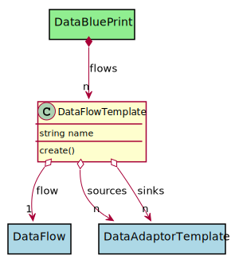

# DataFlowTemplate

Data Flow Template is how a Blue Print refrences a Data Flow with late binding of sources and sinks when data sources are added to a blueprint.

## Attributes

* name:string - Name of the data flow in the blue print

## Associations

| Name | Cardinality | Class | Composition | Owner | Description |
| --- | --- | --- | --- | --- | --- |
| flow | 1 | DataFlow | false | false |  |
| sources | n | DataAdaptorTemplate | false | false |  |
| sinks | n | DataAdaptorTemplate | false | false |  |

## Users of the Model

| Name | Cardinality | Class | Composition | Owner | Description |
| --- | --- | --- | --- | --- | --- |
| flows | n | DataBluePrint | false | true |  |

## Methods

* [create() - Create a Data Flow Template](#Action-create)

<h2>Method Details</h2>
    
### dataflowtemplate.create
* REST - dataflowtemplate/create
* bin - dataflowtemplate create
* js - dataflowtemplate.create

Create a Data Flow Template

| Name | Type | Required | Description |
|---|---|---|---|
| name | string |true | name of the data flow template |
| sinks | json |false | Names of the sinks |
| sources | json |false | Names of the sources |

