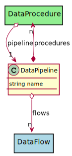

# DataPipeline

Data Pipeline describes a pipeline to process a data source.

## Attributes

* name:string - Name of the data pipeline

## Associations

| Name | Cardinality | Class | Composition | Owner | Description |
| --- | --- | --- | --- | --- | --- |
| procedures | n | DataProcedure | false | true |  |
| flows | n | DataFlow | false | false |  |

## Users of the Model

| Name | Cardinality | Class | Composition | Owner | Description |
| --- | --- | --- | --- | --- | --- |
| pipeline | 1 | DataProcedure | false | false |  |

## Methods

<h2>Method Details</h2>
    

