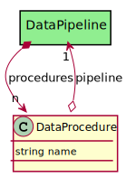

# DataProcedure

Procedure run on the Data Source

## Attributes

* name:string - Name of the procedure

## Associations

| Name | Cardinality | Class | Composition | Owner | Description |
| --- | --- | --- | --- | --- | --- |
| pipeline | 1 | DataPipeline | false | false |  |

## Users of the Model

| Name | Cardinality | Class | Composition | Owner | Description |
| --- | --- | --- | --- | --- | --- |
| procedures | n | DataPipeline | false | true |  |

## Methods

<h2>Method Details</h2>
    

