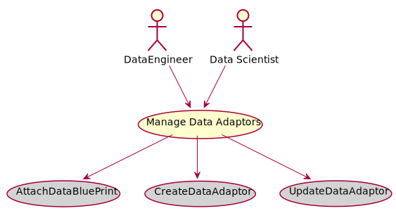

# Manage Data Adaptors

Manage Data Adaptors is the description

## Actors

* [DataEngineer](/actors/DataEngineer/index.md)
* [Data Scientist](/actors/DataScientist/index.md)

## Detail Scenarios
* [Manage Data Adaptors](#Scenario-AttachDataBluePrint)
* [Manage Data Adaptors](#Scenario-CreateDataAdaptor)
* [Manage Data Adaptors](#Scenario-UpdateDataAdaptor)

  
### Scenario Attach Data Blue Print

Attach Data Blue Print is the description

#### Steps

1. To Be Defined

#### Actors

* [Actor](actors/actor/index.md)

### Scenario Create Data Adaptor

Create Data Adaptor is the description

#### Steps

1. To Be Defined

#### Actors

* [Actor](actors/actor/index.md)

### Scenario Update Data Adaptor

Update Data Adaptor is the description

#### Steps

1. To Be Defined

#### Actors

* [Actor](actors/actor/index.md)

