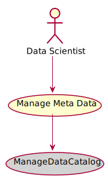

# Manage Meta Data

Manage Meta Data is the description

## Actors

* [Data Scientist](actor-datascientist)

## Detail Scenarios

* [Manage Meta Data](#scenario-ManageDataCatalog)

  
### Scenario Manage Data Catalog

Manage Data Catalog is the description

#### Steps

1. To Be Defined

#### Actors

* [Data Scientist](actor-datascientist)

