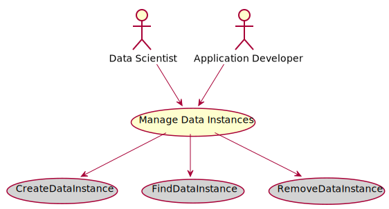

# Manage Data Instances

Manage Data Instances is the description

## Actors

* [Data Scientist](/actors/DataScientist/index.md)
* [Application Developer](/actors/ApplicationDeveloper/index.md)

## Detail Scenarios
* [Manage Data Instances](#Scenario-CreateDataInstance)
* [Manage Data Instances](#Scenario-FindDataInstance)
* [Manage Data Instances](#Scenario-RemoveDataInstance)

  
### Scenario Create Data Instance

Create Data Instance is the description

#### Steps

1. To Be Defined

#### Actors

* [Application Developer](actors/applicationdeveloper/index.md)

### Scenario Find Data Instance

Find Data Instance is the description

#### Steps

1. To Be Defined

#### Actors

* [Actor](actors/actor/index.md)

### Scenario Remove Data Instance

Remove Data Instance is the description

#### Steps

1. To Be Defined

#### Actors

* [Actor](actors/actor/index.md)

