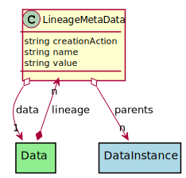

# LineageMetaData

This class is a meta-data class that stores the lineage of the Data Instance. The creation action is stored in the class along with the lineage of the the data instance.

## Attributes

* creationAction:string - Description of the creation
* name:string - Name of the MetaData
* value:string - Value of the MetaData

## Associations

| Name | Cardinality | Class | Composition | Owner | Description |
| --- | --- | --- | --- | --- | --- |
| parents | n | DataInstance | false | false |  |
| data | 1 | Data |  |  | This is a DataInstance Class that the meta-data is tied |

## Users of the Model

| Name | Cardinality | Class | Composition | Owner | Description |
| --- | --- | --- | --- | --- | --- |
| lineage | n | Data | false | true |  |

## Methods

<h2>Method Details</h2>
    

