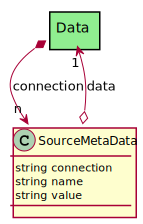

# SourceMetaData

Source Meta-Data is information about the source of the Data Instance. How to connect to the actual data.This is used inconjunction with the Data Adaptor. For example having the ability to connect to a row,column, page or document in a database or filesystem.

## Attributes

* connection:string - Connection string to connect to the DataInstance
* name:string - Name of the MetaData
* value:string - Value of the MetaData

## Associations

| Name | Cardinality | Class | Composition | Owner | Description |
| --- | --- | --- | --- | --- | --- |
| data | 1 | Data |  |  | This is a DataInstance Class that the meta-data is tied |

## Users of the Model

| Name | Cardinality | Class | Composition | Owner | Description |
| --- | --- | --- | --- | --- | --- |
| connection | n | Data | false | true |  |

## Methods

<h2>Method Details</h2>
    

