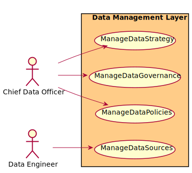
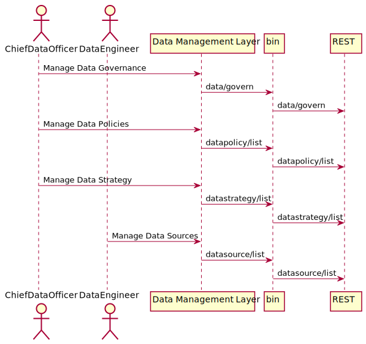
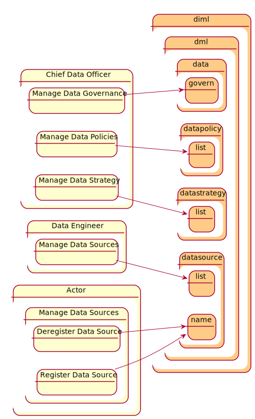
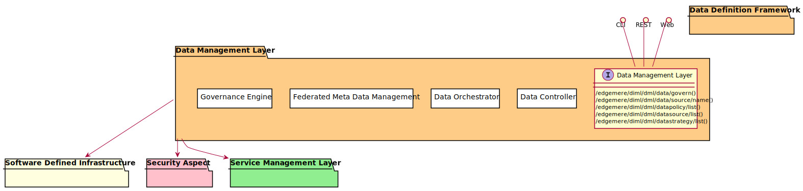
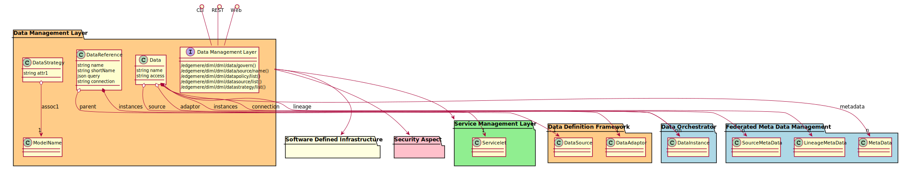

# Data Management Layer

Data Management Layer is a package that contains...

## Use Cases

* [Manage Data Governance](usecsaes/ManageDataGovernance/index.md)
* [Manage Data Policies](usecsaes/ManageDataPolicies/index.md)
* [Manage Data Sources](usecsaes/ManageDataSources/index.md)
* [Manage Data Strategy](usecsaes/ManageDataStrategy/index.md)

## Users
* [ChiefDataOfficer](/actors/cdo)
* [DataEngineer](/actors/dataengineer)

## Interface
The subsystem has a REST, CLI, WebSocket, and Web interface. Use Cases and Scenarios can use any or all
of the interfaces to perform the work that needs to be completed. The following  diagram shows how
users interact with the system.

* [/edgemere/diml/dml/data/govern](./action//edgemere/diml/dml/data/govern)
* [/edgemere/diml/dml/data/source/name](./action//edgemere/diml/dml/data/source/name)
* [/edgemere/diml/dml/datapolicy/list](./action//edgemere/diml/dml/datapolicy/list)
* [/edgemere/diml/dml/datasource/list](./action//edgemere/diml/dml/datasource/list)
* [/edgemere/diml/dml/datastrategy/list](./action//edgemere/diml/dml/datastrategy/list)

## Logical Artifacts
The Data Model for the  Data Management Layer shows how the different objects and classes of object interact
and their structure.

### Sub Packages

* [Data Controller](./dc/index.md)
* [Data Orchestrator](./do/index.md)
* [Federated Meta Data Management](./fmdm/index.md)
* [Governance Engine](./ge/index.md)

### Classes

* [Data](./models//edgemere/diml/dml/Data/index.md)
* [DataReference](./models//edgemere/diml/dml/DataReference/index.md)
* [DataStrategy](./models//edgemere/diml/dml/DataStrategy/index.md)

## Activities and Flows
The Data Management Layer subsystem provides the following activities and flows.

### Messages Handled

| Message | Action | Description |
|---|---|---|

### Messages Sent

TBD

## Deployment Architecture

This subsystem is deployed using micro-services as shown in the diagram below. The 'micro' module is
used to implement the micro-services in the system.
The subsystem also has an CLI, REST and Web Interface exposed through a sailajs application. The sailsjs
application will interface with the micro-services and can monitor and drive work-flows through the mesh of
micro-services.

## Physical Architecture

The Data Management Layer subsystem is is physically laid out on a hybrid cloud infrastructure. Each microservice is shown
how they connect to each other. All of the micro-services communicate to each other and the main app through a
REST interface. A CLI, REST or Web interface for the app is how other subsystems or actors interact. Requests are
forwarded to micro-services through the REST interface of each micro-service.

## Micro-Services
These are the micro-services for the subsystem. The combination of the micro-services help implement
the subsystem's logic.

### dev
Detail information for the [dev environment](./envs/dev/index.md) can be found [here](./envs/dev/index.md)

Services in the dev environment

* frontend : diml_dml_web
* gw : diml_dml_gw

### test
Detail information for the [test environment](./envs/test/index.md) can be found [here](./envs/test/index.md)

Services in the test environment

* frontend : diml_dml_web
* gw : diml_dml_gw

### prod
Detail information for the [prod environment](./envs/prod/index.md) can be found [here](./envs/prod/index.md)

Services in the prod environment

* frontend : diml_dml_web
* gw : diml_dml_gw

## Interface Details

### .edgemere.diml.dml.data.govern
* REST - /edgemere/diml/dml/data/govern
* bin -  edgemere diml dml data govern
* js - .edgemere.diml.dml.data.govern

Description of the action

| Name | Type | Required | Description |
|---|---|---|---|
| attr1 | string |false | Description for the parameter |

### .edgemere.diml.dml.data.source.name
* REST - /edgemere/diml/dml/data/source/name
* bin -  edgemere diml dml data source name
* js - .edgemere.diml.dml.data.source.name

Description of the action

| Name | Type | Required | Description |
|---|---|---|---|
| attr1 | string |false | Description for the parameter |

### .edgemere.diml.dml.datapolicy.list
* REST - /edgemere/diml/dml/datapolicy/list
* bin -  edgemere diml dml datapolicy list
* js - .edgemere.diml.dml.datapolicy.list

Description of the action

| Name | Type | Required | Description |
|---|---|---|---|
| attr1 | string |false | Description for the parameter |

### .edgemere.diml.dml.datasource.list
* REST - /edgemere/diml/dml/datasource/list
* bin -  edgemere diml dml datasource list
* js - .edgemere.diml.dml.datasource.list

Description of the action

| Name | Type | Required | Description |
|---|---|---|---|
| attr1 | string |false | Description for the parameter |

### .edgemere.diml.dml.datastrategy.list
* REST - /edgemere/diml/dml/datastrategy/list
* bin -  edgemere diml dml datastrategy list
* js - .edgemere.diml.dml.datastrategy.list

Description of the action

| Name | Type | Required | Description |
|---|---|---|---|
| attr1 | string |false | Description for the parameter |

