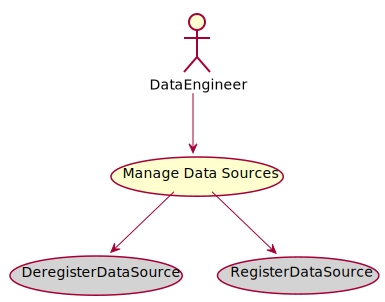

# Manage Data Sources

Manage Data Sources is the description

## Actors

* [DataEngineer](/actors/DataEngineer/index.md)

## Detail Scenarios
* [Manage Data Sources](#Scenario-DeregisterDataSource)
* [Manage Data Sources](#Scenario-RegisterDataSource)

  
### Scenario Deregister Data Source

Deregister Data Source is the description

#### Steps

1. To Be Defined

#### Actors

* [Actor](actors/actor/index.md)

### Scenario Register Data Source

Register Data Source is the description

#### Steps

1. To Be Defined

#### Actors

* [Actor](actors/actor/index.md)

