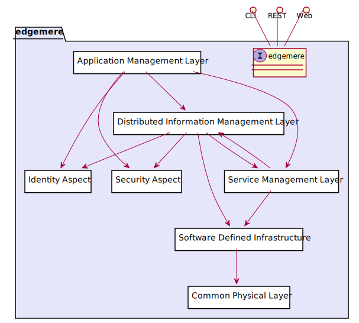
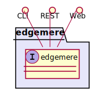

# edgemere

Edgemere is a conceptual architecture targeted to multi-hybrid cloud and edge computing strategies including data,application, service, and infrastructure management. With the growth of IoT devices management of these elements from edge to data center is important to the success of the solution.

Edgemere is a conceptual architecture targeted to multi-hybrid cloud and edge computing strategies including data,
application, service, and infrastructure management. With the growth of IoT devices management of these elements from
edge to data center is important to the success of the solution.

In enable have a system that is future proof and expandable it is important to understand how different parts of the
system relate to each other and to establish isolation layers (through common interfaces or abstractions). This
isolation allows for the different subsystems in the solution to “grow” in parallel with minimal effect on the each
other. With the end goal in mind and the establishment of interfaces between the sub-systems new features for hardware
or software can be added progressively toward the utopian end state.

For detail information about micro-service architecture, use cases, and subsystems on [edgemere](package--edgemere)
click [here](package--edgemere).

This diagram shows how the different subsystems fit together. A quick understanding of each layer will expose the
responsibilities of each layer.

* [Application Layer](package--edgemere-aml) – Responsible for the management (development, test and deployment) of
  applications in the solution
* [Distributed Information Management Layer](package--edgemere-diml) – Responsible for the management (curation,
  governance, lifecycle management, and tagging) of data across a heterogeneous infrastructure (Cloud, Data Center, Edge
  and Client).
* [Service Management Layer](package--edgemere-sml) – Responsible for the deploying, monitoring, and provisioning of
  services (containers) in the solution.
* [Software Defined Infrastructure](package--edgemere-sdi) – Responsible for the management (deploying, monitoring and
  provisioning) of infrastructure (Compute, Storage, Network, and Accelerators) in the solution.
* [Physical Layer](package--edgemere-cpl) – Responsible for the command, control and monitoring of the physical devices
  in the solution.
* [Security Aspect](package--edgemere-sa) – Gives a common security model across the subsystems of the solution.
* [Identity Aspect](package--edgemere-ia) – Give the ability to uniquely identify and attest identity of users,
  hardware, applications, services, and virtual resources.

Many organizations have many of these subsystems already in their toolbox of solutions. Understand what you are
currently using and how those tools fit together and how they interface with each other is important. One of the goals
is to utilize the current tools as a foundation to build upon for the future end goal. A roadmap of technology and
process changes shows how the foundation can be built upon to achieve the long term architecture.

## Use Cases

The following are the use cases of the edgemere subsystem. Each use case has primary and secondary scenarios
that are elaborated in the use case descriptions.

## Users

The following are the actors of the edgemere subsystem. This can include people, other subsystems 
inside the solution and even external subsystems. 

## Interface

The subsystem has a REST, CLI, WebSocket, and Web interface. Use Cases and Scenarios can use any or all
of the interfaces to perform the work that needs to be completed. The following  diagram shows how
users interact with the system.

## Logical Artifacts

The Data Model for the  edgemere subsystem shows how the different objects and classes of object interact
and their structure.

### Sub Packages

The edgemere subsystem has sub packages as well. These subsystems are logical components to better
organize the architecture and make it easier to analyze, understand, design, and implement.

* [Application Management Layer](package--edgemere-aml)
* [Common Physical Layer](package--edgemere-cpl)
* [Distributed Information Management Layer](package--edgemere-diml)
* [Identity Aspect](package--edgemere-ia)
* [Security Aspect](package--edgemere-sa)
* [Service Management Layer](package--edgemere-sml)
* [Software Defined Infrastructure](package--edgemere-sdi)

### Classes

The following are the classes in the data model of the edgemere subsystem.

## Deployment Architecture

This subsystem is deployed using micro-services as shown in the diagram below. The 'micro' module is
used to implement the micro-services in the system. The subsystem also has an CLI, REST and Web Interface
exposed through a nodejs application. The nodejs application will interface with the micro-services and
can monitor and drive work-flows through the mesh of micro-services. The deployment of the subsystem is 
dependent on the environment it is deployed. This subsystem has the following environments:
* [local](environment--edgemere-local)
* [dev](environment--edgemere-dev)
* [test](environment--edgemere-test)
* [prod](environment--edgemere-prod)

## Physical Architecture

The edgemere subsystem is physically laid out on a hybrid cloud infrastructure. Each microservice belongs
to a secure micro-segmented network. All of the micro-services communicate to each other and the main app through a
REST interface. A Command Line Interface (CLI), REST or Web User interface for the app is how other subsystems or actors 
interact. Requests are forwarded to micro-services through the REST interface of each micro-service. The subsystem has
the a unique layout based on the environment the physical space. The following are the environments for this
subsystems.
* [local](environment--edgemere-local)
* [dev](environment--edgemere-dev)
* [test](environment--edgemere-test)
* [prod](environment--edgemere-prod)

## Micro-Services

These are the micro-services for the subsystem. The combination of the micro-services help implement
the subsystem's logic.

### local

Detail information for the [local environment](environment--edgemere-local)
can be found [here](environment--edgemere-local)

Services in the local environment

* admin : edgemere:latest
* pubsub : redis
* web : edgemere_web
* doc : edgemere_doc

### dev

Detail information for the [dev environment](environment--edgemere-dev)
can be found [here](environment--edgemere-dev)

Services in the dev environment

* admin : edgemere:latest
* aml : aml:latest
* cpl : cpl:latest
* diml : diml:latest
* ia : ia:latest
* sa : sa:latest
* sml : sml:latest
* sdi : sdi:latest
* pubsub : redis
* web : edgemere_web
* doc : edgemere_doc

### test

Detail information for the [test environment](environment--edgemere-test)
can be found [here](environment--edgemere-test)

Services in the test environment

* admin : edgemere:latest
* aml : aml:latest
* cpl : cpl:latest
* diml : diml:latest
* ia : ia:latest
* sa : sa:latest
* sml : sml:latest
* sdi : sdi:latest
* pubsub : redis
* web : edgemere_web
* doc : edgemere_doc

### prod

Detail information for the [prod environment](environment--edgemere-prod)
can be found [here](environment--edgemere-prod)

Services in the prod environment

* admin : edgemere:latest
* aml : aml:latest
* cpl : cpl:latest
* diml : diml:latest
* ia : ia:latest
* sa : sa:latest
* sml : sml:latest
* sdi : sdi:latest
* pubsub : redis
* web : edgemere_web
* doc : edgemere_doc

## Activities and Flows
The edgemere subsystem provides the following activities and flows that help satisfy the use
cases and scenarios of the subsystem.

### Messages Sent

TBD

## Interface Details
The edgemere subsystem has a well defined interface. This interface can be accessed using a
command line interface (CLI), REST interface, and Web user interface. This interface is how all other
subsystems and actors can access the system.

