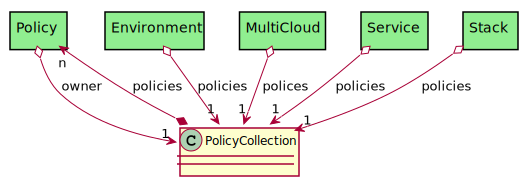

# PolicyCollection

Any entity that has policies should have a Policy Collection association

## Attributes

## Associations

| Name | Cardinality | Class | Composition | Owner | Description |
| --- | --- | --- | --- | --- | --- |
| policies | n | Policy | true | true |  |

## Users of the Model

| Name | Cardinality | Class | Composition | Owner | Description |
| --- | --- | --- | --- | --- | --- |
| owner | 1 | Policy | false | false |  |
| policies | 1 | Environment | false | false |  |
| polices | 1 | MultiCloud | false | false |  |
| policies | 1 | Service | false | false | Policies of the Service |
| policies | 1 | Stack | false | false | Policy Collection |

## Methods

<h2>Method Details</h2>
    

