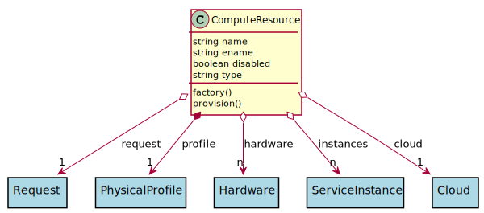

# ComputeResource

Logical Resource of Compute CPUs that are provisioned

## Attributes

* name:string - Name of the resource
* ename:string - Extended name of the resource
* disabled:boolean - Disabled Resource
* type:string - Type of resource, Network, Storage, Compute or Accelerator

## Associations

| Name | Cardinality | Class | Composition | Owner | Description |
| --- | --- | --- | --- | --- | --- |
| request | 1 | Request | false | false |  |
| profile | 1 | PhysicalProfile | true | true |  |
| hardware | n | Hardware | false | false |  |
| instances | n | ServiceInstance | false | false |  |
| cloud | 1 | Cloud | false | false |  |

## Users of the Model

| Name | Cardinality | Class | Composition | Owner | Description |
| --- | --- | --- | --- | --- | --- |

## Methods

* [factory() - Create a Resource based on the hardware to resource table](#Action-factory)

* [provision() - Provision the Resource](#Action-provision)

<h2>Method Details</h2>
    
### computeresource.factory
* REST - computeresource/factory
* bin - computeresource factory
* js - computeresource.factory

Create a Resource based on the hardware to resource table

| Name | Type | Required | Description |
|---|---|---|---|
| name | string |true | name of the Resource |
| value | object |true | value of the hardware |

### computeresource.provision
* REST - computeresource/provision
* bin - computeresource provision
* js - computeresource.provision

Provision the Resource

| Name | Type | Required | Description |
|---|---|---|---|

