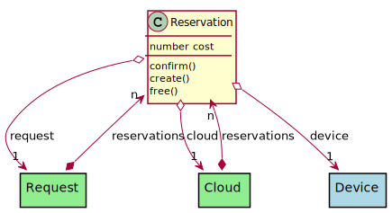
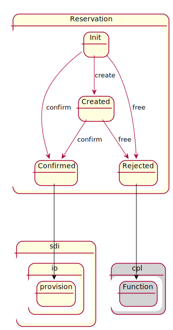

# Reservation

A reservation fullfils the request to the system for resources. When a request for a resource is made from a cloud. A reservation for the resource request is created for each device or devices that can satistfy the request. When the request is fulfilled the reservations are then no longer needed.

## Attributes

* cost:number - This is the cost of the reservation

## Associations

| Name | Cardinality | Class | Composition | Owner | Description |
| --- | --- | --- | --- | --- | --- |
| device | 1 | Device | false | false |  |
| request | 1 | Request | false | false |  |
| cloud | 1 | Cloud | false | false |  |

## Users of the Model

| Name | Cardinality | Class | Composition | Owner | Description |
| --- | --- | --- | --- | --- | --- |
| reservations | n | Cloud | false | true |  |
| reservations | n | Request | false | true |  |

## State Net

| Name | Description | Events |
| --- | --- | --- |
| Init |  | create-&gt;Created, confirm-&gt;Confirmed, free-&gt;Rejected,  |
| Created | Reservation is created and ready to be evaluated for best fit. | confirm-&gt;Confirmed, free-&gt;Rejected,  |
| Confirmed | Reservation is confirmed and the resources will be provisioned. |  |
| Rejected | Reservation was rejected and devices freed up. |  |

## Methods

* [confirm() - Confirm the Reservation](#Action-confirm)

* [create() - Create the Reservation](#Action-create)

* [free() - Confirm the Reservation](#Action-free)

<h2>Method Details</h2>
    
### reservation.confirm
* REST - reservation/confirm
* bin - reservation confirm
* js - reservation.confirm

Confirm the Reservation

| Name | Type | Required | Description |
|---|---|---|---|

### reservation.create
* REST - reservation/create
* bin - reservation create
* js - reservation.create

Create the Reservation

| Name | Type | Required | Description |
|---|---|---|---|

### reservation.free
* REST - reservation/free
* bin - reservation free
* js - reservation.free

Confirm the Reservation

| Name | Type | Required | Description |
|---|---|---|---|

