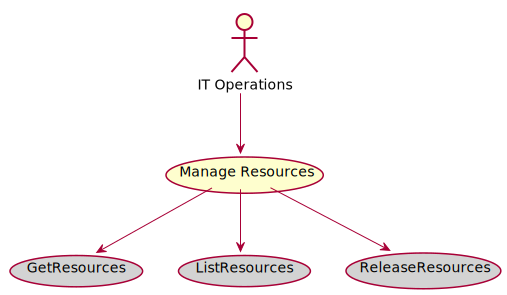

# Manage Resources

Manage Resources includes creating resources, listing and planning for resources.

## Actors

* [IT Operations](/actors/ITOperations/index.md)

## Detail Scenarios
* [Manage Resources](#Scenario-GetResources)
* [Manage Resources](#Scenario-ListResources)
* [Manage Resources](#Scenario-ReleaseResources)

  
### Scenario Get Resources

Get Resources based on a set of requirements, this could be one resource or a set of resources. Requires a cloud and requirements to be specified. A name for the resources can be requested.

#### Steps

1. [device create --name hostgr1 --file ./templates/device.yaml](doc/action/device/create)

1. [device create --name hostgr2 --file ./templates/device.yaml](doc/action/device/create)

1. [device create --name hostgr3 --file ./templates/device.yaml](doc/action/device/create)

1. [device create --name hostgr4 --file ./templates/device.yaml](doc/action/device/create)

1. [device create --name hostgr5 --file ./templates/device.yaml](doc/action/device/create)

1. [device create --name hostgr6 --file ./templates/device.yaml](doc/action/device/create)

1. [datacenter create --name dcgr1](doc/action/datacenter/create)

1. [datacenter adddevices --name dcgr1 --items hostgr1,hostgr2,hostgr3,hostgr4,hostgr5,hostgr6](doc/action/datacenter/adddevices)

1. [cloud create --name cloudgr1](doc/action/cloud/create)

1. [cloud adddatacenters --name cloudgr1 --items dcgr1](doc/action/cloud/adddatacenters)

1. [datacenter disable --name dcgr1](doc/action/datacenter/disable)

1. [sdi resource/get --name myRes --cloud cloudgr1 --requirements ./templates/requirements.yaml](doc/action/sdi/resource/get)

1. [sdi resource/get --name myRes2 --cloud cloudgr1 --requirements ./templates/requirements2.yaml](doc/action/sdi/resource/get)

1. [sdi resource/get --name myRes3 --cloud cloudgr1 --requirements ./templates/requirements3.yaml](doc/action/sdi/resource/get)

1. [sdi resource/get --name myRes4 --cloud cloudgr1 --requirements ./templates/requirements.yaml](doc/action/sdi/resource/get)

#### Actors

* [IT Operations](actors/itops/index.md)

### Scenario List Resources

List Resources and their utilization numbers. This is used for capacity planning.

#### Steps

1. [device create --name hostlr1 --file ./templates/device.yaml](doc/action/device/create)

1. [device create --name hostlr2 --file ./templates/device.yaml](doc/action/device/create)

1. [device create --name hostlr3 --file ./templates/device.yaml](doc/action/device/create)

1. [device create --name hostlr4 --file ./templates/device.yaml](doc/action/device/create)

1. [device create --name hostlr5 --file ./templates/device.yaml](doc/action/device/create)

1. [device create --name hostlr6 --file ./templates/device.yaml](doc/action/device/create)

1. [datacenter create --name dclr1](doc/action/datacenter/create)

1. [datacenter adddevices --name dclr1 --items hostlr1,hostlr2,hostlr3,hostlr4,hostlr5,hostlr6](doc/action/datacenter/adddevices)

1. [cloud create --name cloudlr1](doc/action/cloud/create)

1. [cloud adddatacenters --name cloudlr1 --items dclr1](doc/action/cloud/adddatacenters)

1. [datacenter disable --name dclr1](doc/action/datacenter/disable)

1. [sdi resource/get --name myRes --cloud cloudlr1 --requirements ./templates/requirements.yaml](doc/action/sdi/resource/get)

1. [sdi resource/get --name myRes2 --cloud cloudlr1 --requirements ./templates/requirements2.yaml](doc/action/sdi/resource/get)

1. [sdi resource/get --name myRes3 --cloud cloudlr1 --requirements ./templates/requirements3.yaml](doc/action/sdi/resource/get)

1. [sdi resource/get --name myRes4 --cloud cloudlr1 --requirements ./templates/requirements.yaml](doc/action/sdi/resource/get)

#### Actors

* [IT Operations](actors/itops/index.md)

### Scenario Release Resources

Release Resources based on the name given when the Resources are requested

#### Steps

1. To Be Defined

#### Actors

* [IT Operations](actors/itops/index.md)

