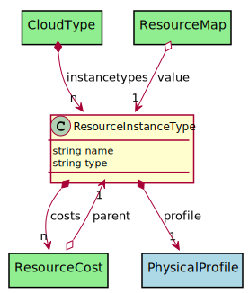

# ResourceInstanceType

This represents a resoure instance type in the different clouds.

## Attributes

* name:string - Name of the resource instance
* type:string - Type of the resource instance

## Associations

| Name | Cardinality | Class | Composition | Owner | Description |
| --- | --- | --- | --- | --- | --- |
| profile | 1 | PhysicalProfile | true | true |  |
| costs | n | ResourceCost | true | true | Cost model for the Resource Instance Type |

## Users of the Model

| Name | Cardinality | Class | Composition | Owner | Description |
| --- | --- | --- | --- | --- | --- |
| instancetypes | n | CloudType | true | true | This is a list of resource types for the cloud type |
| parent | 1 | ResourceCost | false | false |  |
| value | 1 | ResourceMap | false | false |  |

## Methods

<h2>Method Details</h2>
    

