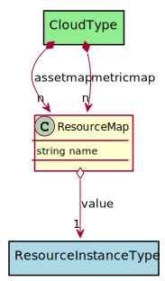

# ResourceMap

This maps generalized resource name/requirement to one or more requirements for the specific cloud resource.

## Attributes

* name:string - Name of the resource reference

## Associations

| Name | Cardinality | Class | Composition | Owner | Description |
| --- | --- | --- | --- | --- | --- |
| value | 1 | ResourceInstanceType | false | false |  |

## Users of the Model

| Name | Cardinality | Class | Composition | Owner | Description |
| --- | --- | --- | --- | --- | --- |
| assetmap | n | CloudType | true | true | This map allows mapping normalized resource types to specific cloud resource types for this cloud type |
| metricmap | n | CloudType | true | true | This maps metrics from the cloud to the normalized metrics |

## Methods

<h2>Method Details</h2>
    

