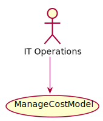

# ManageCostModel

ManageCostModel allows IT Operators to manage the cost of using resources. Each cloud has different cost models depending on the use and the time of day they are used. Private cloud resources should have cost models estalbished for them as well.

## Actors

* [IT Operations](/actors/ITOperations/index.md)

## Detail Scenarios

  

