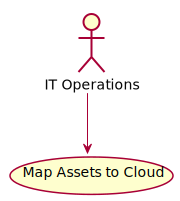

# Map Assets to Cloud

Map Assets to Cloud allows IT Operations to map assets to resource instance types. The Resource Instance Type allows services to access preconfigurated configurations of resource types.

## Actors

* [IT Operations](/actors/ITOperations/index.md)

## Detail Scenarios

  

