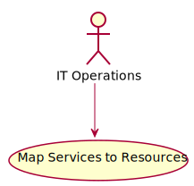

# Map Services to Resources

Map Services to Resources allows the system and actors to map service level agreements to specific resource instance types, or create new resource instance types dynamically on the fly. This allows for the reuse of resources that might already be allocated and can be shared for optimization of resources and time to deployments.

## Actors

* [IT Operations](actor-itops)

## Detail Scenarios

  

