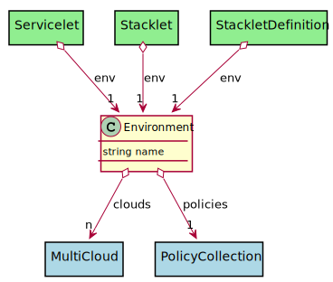
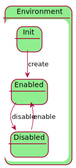

# Environment

An environment represents a group of clouds, and policies that service are deployed. Examples of environments are development, test, production

## Attributes

* name:string - Name of the environment

## Associations

| Name | Cardinality | Class | Composition | Owner | Description |
| --- | --- | --- | --- | --- | --- |
| clouds | n | MultiCloud | false | false |  |
| policies | 1 | PolicyCollection | false | false |  |

## Users of the Model

| Name | Cardinality | Class | Composition | Owner | Description |
| --- | --- | --- | --- | --- | --- |
| env | 1 | Servicelet | false | false | Environment for the Servicelet |
| env | 1 | Stacklet | false | false | Environment for the Servicelet |
| env | 1 | StackletDefinition | false | false | Environment for the Stacklet |

## State Net

| Name | Description | Events |
| --- | --- | --- |
| Init | Initial State | create-&gt;Enabled,  |
| Enabled | Environment is available to be used | disable-&gt;Disabled,  |
| Disabled | Environment is not available to be used | enable-&gt;Enabled,  |

## Methods

<h2>Method Details</h2>
    

