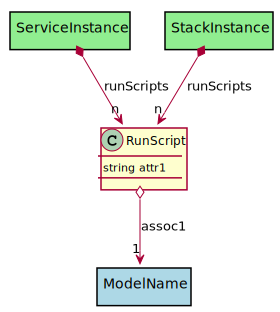

# RunScript

Description long description

## Attributes

* attr1:string - description long description

## Associations

| Name | Cardinality | Class | Composition | Owner | Description |
| --- | --- | --- | --- | --- | --- |
| assoc1 | 1 | ModelName | false | false |  |

## Users of the Model

| Name | Cardinality | Class | Composition | Owner | Description |
| --- | --- | --- | --- | --- | --- |
| runScripts | n | ServiceInstance | true | true | Scripts to run for the different actions performed in the service |
| runScripts | n | StackInstance | true | true | Scripts to run for the different actions performed in the service |

## Methods

<h2>Method Details</h2>
    

