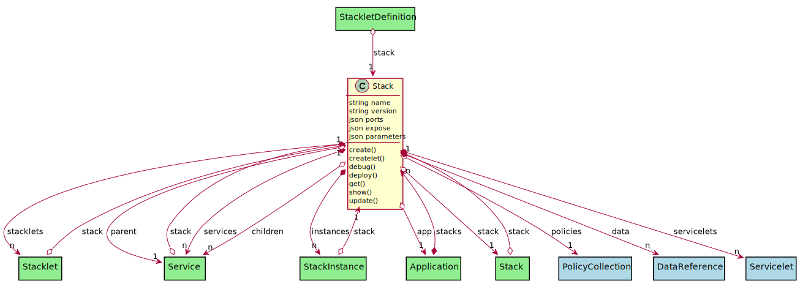

# Stack

A Stack is an aggregation of services in one context. The Stack can have any number of Services and has a stacklet for each environment in the system. Application typically have 1 or more stacks to define their applications.

## Attributes

* name:string - Name of the Service
* version:string - Version of the Service
* ports:json - List of ports internally
* expose:json - List of ports to expose
* parameters:json - [ {name: value} ] - Lsit of parameters for the service

## Associations

| Name | Cardinality | Class | Composition | Owner | Description |
| --- | --- | --- | --- | --- | --- |
| policies | 1 | PolicyCollection | false | false | Policy Collection |
| stacklets | n | Stacklet | true | true | Stacklets of the stack and environment |
| services | n | Service | true | true | Services of the stack |
| instances | n | StackInstance | true | true | Instances of the stack |
| app | 1 | Application | false | false | Applications of the stacks |
| data | n | DataReference | false | true | Data for the stack |
| stack | 1 | Stack | false | false | Parent Stack of the service |
| servicelets | n | Servicelet | true | true | Servicelets of the service (Environment) |
| children | n | Service | false | false | Child services of the service |
| parent | 1 | Service | false | false | Parent of the service |

## Users of the Model

| Name | Cardinality | Class | Composition | Owner | Description |
| --- | --- | --- | --- | --- | --- |
| stacks | n | Application | true | true |  |
| stack | 1 | Service | false | false | Parent Stack of the service |
| stack | 1 | Stack | false | false | Parent Stack of the service |
| stack | 1 | Stacklet | false | false | Parent Stack for the Stacklet |
| stack | 1 | StackletDefinition | false | false | Stack for the Stacklet |
| stack | 1 | StackInstance | false | false | Stack of the Stack Instance |

## Methods

* [create() - Create a Stack](#action-create)

* [createlet() - Create a Stack](#action-createlet)

* [debug() - Debug a Stack](#action-debug)

* [deploy() - Deploy a Stack](#action-deploy)

* [get() - Get a Stack](#action-get)

* [show() - Show a Stack](#action-show)

* [update() - Update a Stack](#action-update)

<h2>Method Details</h2>
    
### Action stack create

* REST - stack/create
* bin - stack create
* js - stack.create

Create a Stack

| Name | Type | Required | Description |
|---|---|---|---|

### Action stack createlet

* REST - stack/createlet
* bin - stack createlet
* js - stack.createlet

Create a Stack

| Name | Type | Required | Description |
|---|---|---|---|

### Action stack debug

* REST - stack/debug
* bin - stack debug
* js - stack.debug

Debug a Stack

| Name | Type | Required | Description |
|---|---|---|---|

### Action stack deploy

* REST - stack/deploy
* bin - stack deploy
* js - stack.deploy

Deploy a Stack

| Name | Type | Required | Description |
|---|---|---|---|
| tag | string |false | Tag of the deployment of the stack. This is used to reference the deployed stack. |
| env | string |false | Name of the deployment environment |
| args | json |false | Arguments passed into the stack deployment |

### Action stack get

* REST - stack/get
* bin - stack get
* js - stack.get

Get a Stack

| Name | Type | Required | Description |
|---|---|---|---|

### Action stack show

* REST - stack/show
* bin - stack show
* js - stack.show

Show a Stack

| Name | Type | Required | Description |
|---|---|---|---|

### Action stack update

* REST - stack/update
* bin - stack update
* js - stack.update

Update a Stack

| Name | Type | Required | Description |
|---|---|---|---|

