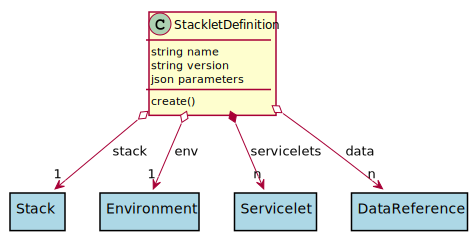

# StackletDefinition

This is a combination of the stack with a specific environment. This allows for a stack to behave differently depending on the envionrment it is in.

## Attributes

* name:string - Name of the Stacklet
* version:string - Name of the Stacklet
* parameters:json - Parameters for the stacklet [ {name:value }]

## Associations

| Name | Cardinality | Class | Composition | Owner | Description |
| --- | --- | --- | --- | --- | --- |
| stack | 1 | Stack | false | false | Stack for the Stacklet |
| env | 1 | Environment | false | false | Environment for the Stacklet |
| servicelets | n | Servicelet | true | true | Service with environment for the Stacklet |
| data | n | DataReference | false | false | Data References to the data in the Stacklet |

## Users of the Model

| Name | Cardinality | Class | Composition | Owner | Description |
| --- | --- | --- | --- | --- | --- |

## Methods

* [create() - Create a Stack](#action-create)

<h2>Method Details</h2>
    
### Action stackletdefinition create

* REST - stackletdefinition/create
* bin - stackletdefinition create
* js - stackletdefinition.create

Create a Stack

| Name | Type | Required | Description |
|---|---|---|---|

