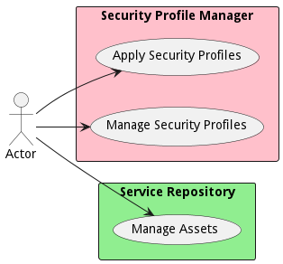

{#actor-function toLowerCase() { [native code] }}

# Actor

Default Actor of the system.

## Top Level Documentation

This is my test documentation

## Use Cases

* [Apply Security Profiles](usecase-ApplySecurityProfiles)
* [Manage Security Profiles](usecase-ManageSecurityProfiles)
* [Manage Assets](usecase-ManageAssets)

## User Interface
TBD

## Command Line Interface
* [ edgemere sa spm data/govern](action--edgemere-sa-spm-data-govern) - Apply Security Profiles is the description
* [ edgemere sa spm data/govern](action--edgemere-sa-spm-data-govern) - Manage Security Profiles is the description
* [ edgemere sml sr data/govern](action--edgemere-sml-sr-data-govern) - Manage Assets is the description

