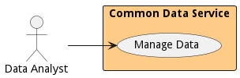

{#actor-function toLowerCase() { [native code] }}

# Data Analyst

Uses Data solutions produced by the Data Scientist and Data Engineer to provide business value to the organization.

The data analyst uses data to build insight based on the data scientist models. Their job is to analyze the results and find business value from the analysis.

## Use Cases

* [Manage Data](usecase-ManageData)

## User Interface
TBD

## Command Line Interface
* [ edgemere diml cds data/list](action--edgemere-diml-cds-data-list) - Manage Data is the description

