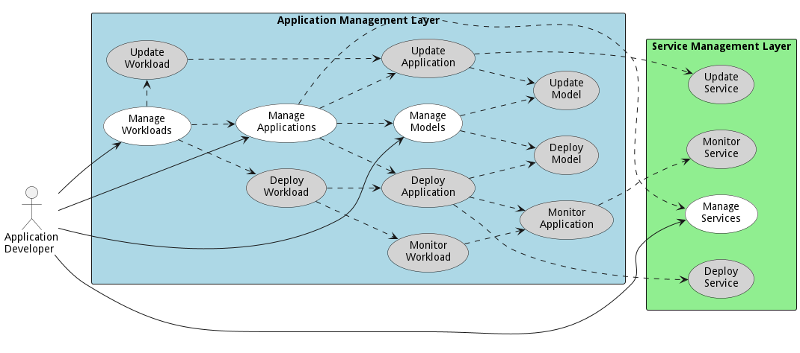
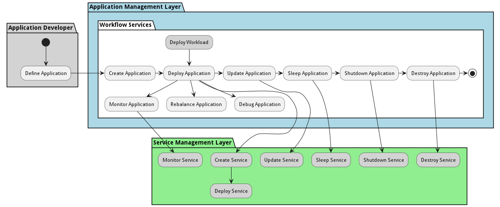
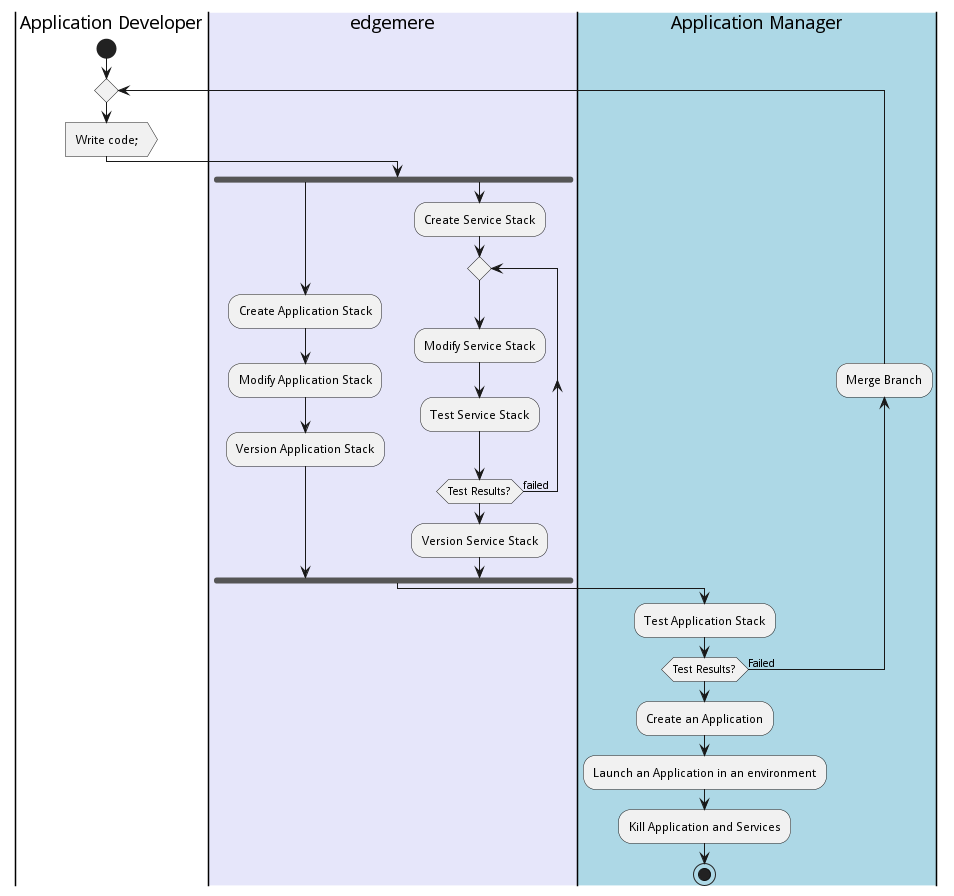
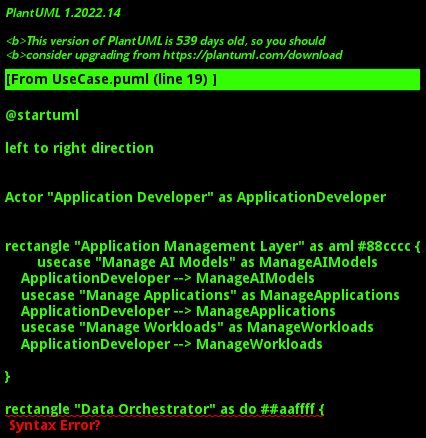

{#actor-function toLowerCase() { [native code] }}

# Application Developer

The Application Developer work in coordination with DevOps to manage services, applications and workloads through the development pipeline.

The Application Developer work in coordination with [DevOps](/doc/actor/devops) to  
manage services, applications and workloads through the development pipeline

The following arethe usecases for the Application Developer and how they interaction with other subsytstems.

This diagram shows the activities of the Application Developer and how it interactions with Edgemeree and its 
subsystems.

This is a typical workflow of an application developer in edgemere.

## Use Cases

* [Manage AI Models](usecase-ManageAIModels)
* [Manage Applications](usecase-ManageApplications)
* [Manage Workloads](usecase-ManageWorkloads)
* [Manage Data Instances](usecase-ManageDataInstances)
* [Manage Stacks](usecase-ManageStacks)
* [Manage Services](usecase-ManageServices)

## User Interface
TBD

## Command Line Interface
* [ edgemere aml aimodel list](action--edgemere-aml-aimodel-list) - Data Scientist manages AI models and ties them to and application and data set. DevOps will make sure when applications and AI models are updated that they are updatedtogether.
* [ edgemere aml application list](action--edgemere-aml-application-list) - DevOps Engineers and Application Developers need the ability to manage applications across multiple environments, clouds, and types of infrastructure.
* [ edgemere aml workload list](action--edgemere-aml-workload-list) - Application Developers need the ability to connect applications together through Workflows. This gives the organization the automate complex data interactions between legacy and modern applications across a hybrid infrastructure (Multi-Hybrid Cloud).
* [ edgemere diml dml do datainstance list](action--edgemere-diml-dml-do-datainstance-list) - Manage Data Instances is the description
* [ edgemere sml so stack list](action--edgemere-sml-so-stack-list) - Manage Stacks allows the stack developer to create, update, and delete stacks.
* [ edgemere sml service list](action--edgemere-sml-service-list) - Manage Services is the description

