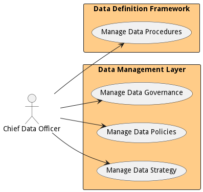

{#actor-cdo}

# Chief Data Officer

Responsible for setting strategy and governance of data in the organization.

The Chief Data Officer is responsible for setting the data strategy for the organization.

## Use Cases

* [Manage Data Procedures](usecase-ManageDataProcedures)
* [Manage Data Governance](usecase-ManageDataGovernance)
* [Manage Data Policies](usecase-ManageDataPolicies)
* [Manage Data Strategy](usecase-ManageDataStrategy)

## User Interface
TBD

## Command Line Interface
* [ edgemere diml ddf dataprocedure list](action--edgemere-diml-ddf-dataprocedure-list) - Manage Data Procedures is the description
* [ edgemere diml dml data govern](action--edgemere-diml-dml-data-govern) - Manage Data Governance is the description
* [ edgemere diml dml datapolicy list](action--edgemere-diml-dml-datapolicy-list) - Manage Data Policies is the description
* [ edgemere diml dml datastrategy list](action--edgemere-diml-dml-datastrategy-list) - Manage Data Strategy is the description

