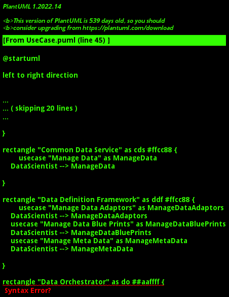

{#actor-function toLowerCase() { [native code] }}

# Data Scientist

Responsible for the architecture and development of data analytic models and solutions. They work closely with the Data engineer to deliver solutions to the Data Analyst.

## Use Cases

* [Manage AI Models](usecase-ManageAIModels)
* [Manage Data](usecase-ManageData)
* [Manage Data Adaptors](usecase-ManageDataAdaptors)
* [Manage Data Blue Prints](usecase-ManageDataBluePrints)
* [Manage Meta Data](usecase-ManageMetaData)
* [Manage Data Instances](usecase-ManageDataInstances)

## User Interface
TBD

## Command Line Interface
* [ edgemere aml aimodel list](action--edgemere-aml-aimodel-list) - Data Scientist manages AI models and ties them to and application and data set. DevOps will make sure when applications and AI models are updated that they are updatedtogether.
* [ edgemere diml cds data list](action--edgemere-diml-cds-data-list) - Manage Data is the description
* [ edgemere diml ddf datadaptor list](action--edgemere-diml-ddf-datadaptor-list) - Manage Data Adaptors is the description
* [ edgemere diml ddf datablueprint list](action--edgemere-diml-ddf-datablueprint-list) - Manage Data Blue Prints is the description
* [ edgemere diml ddf metadata list](action--edgemere-diml-ddf-metadata-list) - Manage Meta Data is the description
* [ edgemere diml dml do datainstance list](action--edgemere-diml-dml-do-datainstance-list) - Manage Data Instances is the description

