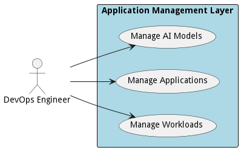

{#actor-function toLowerCase() { [native code] }}

# DevOps Engineer

Responsible for the management of the automation of the delivery of applications and solutions in the organization.

## Use Cases

* [Manage AI Models](usecase-ManageAIModels)
* [Manage Applications](usecase-ManageApplications)
* [Manage Workloads](usecase-ManageWorkloads)

## User Interface
TBD

## Command Line Interface
* [ edgemere aml aimodel/list](action--edgemere-aml-aimodel-list) - Data Scientist manages AI models and ties them to and application and data set. DevOps will make sure when applications and AI models are updated that they are updatedtogether.
* [ edgemere aml application/list](action--edgemere-aml-application-list) - DevOps Engineers and Application Developers need the ability to manage applications across multiple environments, clouds, and types of infrastructure.
* [ edgemere aml workload/list](action--edgemere-aml-workload-list) - Application Developers need the ability to connect applications together through Workflows. This gives the organization the automate complex data interactions between legacy and modern applications across a hybrid infrastructure (Multi-Hybrid Cloud).

