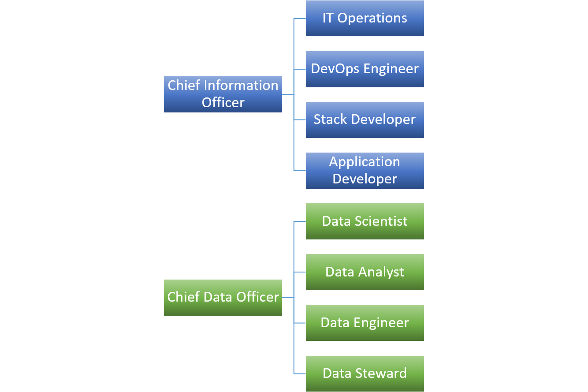
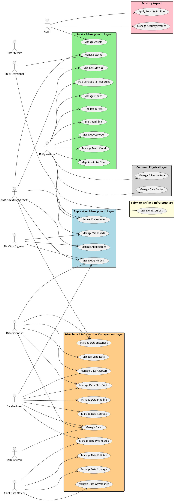

There are several users of the system. We first took a use case analysis approach to the architecture. First,
identifying the actors/users of the system and building out how the actor uses the system? What their key objectives and
goals are? and How they use the system? This list is not an exhaustive list of all actors of the system but are the
primary actors.

These actors are found in most organizations and there are several different organizational structures that can be
employed. The key is to identify the people or organization that fits the different actors in the systems. The following
is an example of a centralized organizational structure of the actors of the system.

# Actors

* [Application Developer](actor-applicationdeveloper) - The Application Developer work in coordination with DevOps to manage services, applications and workloads through the development pipeline.
* [Chief Data Officer](actor-cdo) - Responsible for setting strategy and governance of data in the organization.
* [Data Analyst](actor-analyst) - Uses Data solutions produced by the Data Scientist and Data Engineer to provide business value to the organization.
* [DataEngineer](actor-dataengineer) - Responsible for operationalization of data pipeline and the automation and deployment of data solutions. They work closely with the Data Scientist to deliver solutions to data analyst.
* [Data Scientist](actor-datascientist) - Responsible for the architecture and development of data analytic models and solutions. They work closely with the Data engineer to deliver solutions to the Data Analyst.
* [Data Steward](actor-datasteward) - Responsible for the governance of data in their organization. They implement policies established by the CDO.
* [DevOps Engineer](actor-devops) - Responsible for the management of the automation of the delivery of applications and solutions in the organization.
* [IT Operations](actor-itops) - Responsible for the management of the infrastructure.
* [SecurityEngineer](actor-securityengineer) - Long description
* [Security Operator](actor-securityoperator) - Long description
* [Stack Developer](actor-stackdev) - Responsible for developing reusable micro-services and application stacks in the organization.

