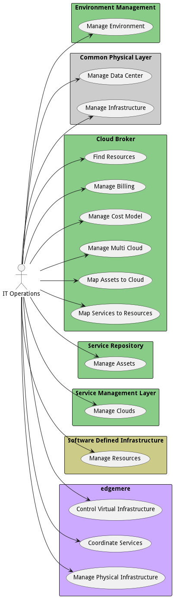

{#actor-itops}

# IT Operations

Responsible for the management of the infrastructure.

## Use Cases

* [Manage Environment](usecase-ManageEnvironment)
* [Manage Data Center](usecase-ManageDataCenter)
* [Manage Infrastructure](usecase-ManageInfrastructure)
* [Find Resources](usecase-FindResources)
* [ManageBilling](usecase-ManageBilling)
* [ManageCostModel](usecase-ManageCostModel)
* [Manage Multi Cloud](usecase-ManageMultiCloud)
* [Map Assets to Cloud](usecase-MapAssetstoCloud)
* [Map Services to Resources](usecase-MapServicestoResources)
* [Manage Assets](usecase-ManageAssets)
* [Manage Clouds](usecase-ManageClouds)
* [Manage Resources](usecase-ManageResources)

## User Interface
TBD

## Command Line Interface
* [ edgemere aml ds em environment list](action--edgemere-aml-ds-em-environment-list) - Manage Environment allows the actors (IT Operations and Stack Developer) to create environments, and establish policies for services running in the environment.
* [ edgemere cpl datacenter list](action--edgemere-cpl-datacenter-list) - IT Operations manages data centers by creating, deleting, enabling and disabling devicesand aggregated devices
* [ edgemere cpl data govern](action--edgemere-cpl-data-govern) - Manage Infrastructure is the description
* [ edgemere sml cb resources find](action--edgemere-sml-cb-resources-find) - Find Resources that have been allocated in the multi-cloud ecosystem. This should give the actor the ability to find resources based on id, name, or metrics.
* [ edgemere sml cb billing list](action--edgemere-sml-cb-billing-list) - ManageBilling allows the IT Operations Manager to establish periodic billing for the usage of the resources allocated for the services deployed into the cloud. The accounting and billing should be accessible for users and groups of users.
* [ edgemere sml cb ResourceInstanceType list](action--edgemere-sml-cb-ResourceInstanceType-list) - ManageCostModel allows IT Operators to manage the cost of using resources. Each cloud has different cost models depending on the use and the time of day they are used. Private cloud resources should have cost models estalbished for them as well.
* [ edgemere sml cb multicloud list](action--edgemere-sml-cb-multicloud-list) - Manage Multi Cloud allows actors to create multi-clouds by adding clouds. Management of policies for the multi-cloud and all of the services deployed to a multi-cloud is performed by IT Operations.
* [ edgemere sml cb multicloud mapresources](action--edgemere-sml-cb-multicloud-mapresources) - Map Assets to Cloud allows IT Operations to map assets to resource instance types. The Resource Instance Type allows services to access preconfigurated configurations of resource types.
* [ edgemere sml cb service mapresources](action--edgemere-sml-cb-service-mapresources) - Map Services to Resources allows the system and actors to map service level agreements to specific resource instance types, or create new resource instance types dynamically on the fly. This allows for the reuse of resources that might already be allocated and can be shared for optimization of resources and time to deployments.
* [ edgemere sml sr assets list](action--edgemere-sml-sr-assets-list) - Manage Assets is the description
* [ edgemere sml Cloud list](action--edgemere-sml-Cloud-list) - Manage Clouds is the description
* [ edgemere sdi resource list](action--edgemere-sdi-resource-list) - Manage Resources includes creating resources, listing and planning for resources.

