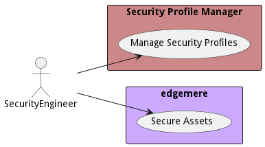

# SecurityEngineer

Long description

## Use Cases

* [Manage Security Profiles](usecase-ManageSecurityProfiles)

## User Interface
TBD

## Command Line Interface
* [ edgemere sa spm securityprofile list](action--edgemere-sa-spm-securityprofile-list) - Manage Security Profiles allows the security engineer to create, updated, and destroy security profiles in the system. Security profiles are attached to identity elements in the system and enforce security policies contained in the profiles.

