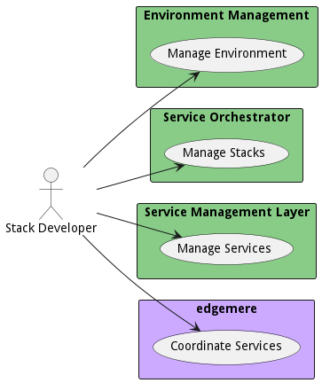

# Stack Developer

Responsible for developing reusable micro-services and application stacks in the organization.

## Use Cases

* [Manage Environment](usecase-ManageEnvironment)
* [Manage Stacks](usecase-ManageStacks)
* [Manage Services](usecase-ManageServices)

## User Interface
TBD

## Command Line Interface
* [ edgemere aml ds em environment list](action--edgemere-aml-ds-em-environment-list) - Manage Environment allows the actors (IT Operations and Stack Developer) to create environments, and establish policies for services running in the environment.
* [ edgemere sml so stack list](action--edgemere-sml-so-stack-list) - Manage Stacks allows the stack developer to create, update, and delete stacks.
* [ edgemere sml service list](action--edgemere-sml-service-list) - Manage Services is the description

