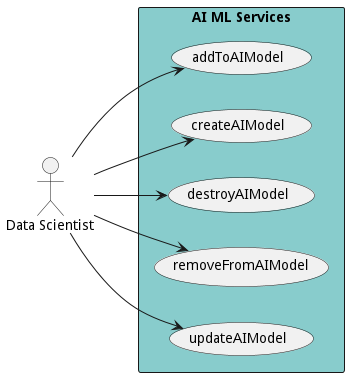
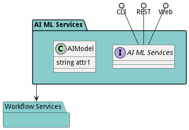

# AI ML Services

The &#34;ams&#34; package provides an &#34;AIModel&#34; class with capabilities for creation, deletion, and updating, as well as adding or removing features in Artificial Intelligence and Machine Learning applications, supported by the encompassing descriptions and documentations on inference, learning, and various AI modes.

Artificial Intelligence and Machine Learning (AI&ML)

The AI&ML package provides a structured approach to implementing advanced machine learning algorithms and artificial intelligence models in different use cases. This package includes significant classes, workflows, and functions that help create, update, and destroy AI models. Rest assured, this package is designed to handle your AI models with utmost reliability and efficiency.

The 'AIModel' class, represented by 'ams,' is the heart of this package. It's designed with your convenience in mind, packed with specific methods such as 'create,' 'destroy,' 'update,' 'addTo,' and 'remove from.' The 'create' method follows a default structure to establish a new AI model, while 'update' is there for modifying existing models. 'Destroy' is your go-to for discarding a model, and 'addTo' and 'removeFrom' are there to help you manage your AI models effortlessly. This user-friendly design ensures that you can navigate the complexities of AI and machine learning with ease.

Apart from these methods, 'AIModel' has an attribute 'attr1,' serving as a string type variable with a long description. This attribute is designed to store additional information about your AI model, such as its purpose, data sources, or key features. You can use it to provide a comprehensive overview of your model, making it easier to manage and understand.

The AI&ML package encourages using different use cases, such as sentiment analysis, image recognition, and anomaly detection, for running, testing, and experimenting with algorithms and AI models. The package documentation also includes an overview of the workflows in building and managing AI models, providing you with a comprehensive guide on how to use the package effectively in various scenarios.

In summary, the AI&ML package is a comprehensive toolkit that equips you with everything you need to employ AI and machine learning algorithms in various use-case scenarios. It provides robust methods for handling AI models, a supportive workflow environment, all aimed towards facilitating a more in-depth exploration of the constantly evolving AI landscape. With this package, you can confidently navigate the complex world of AI and machine learning, opening up a world of exciting possibilities for your projects.

## Use Cases

The following are the use cases of the AI ML Services subsystem. Each use case has primary and secondary scenarios
that are elaborated in the use case descriptions.

* [addTo AIModel](usecase-addToAIModel)
* [create AIModel](usecase-createAIModel)
* [destroy AIModel](usecase-destroyAIModel)
* [removeFrom AIModel](usecase-removeFromAIModel)
* [update AIModel](usecase-updateAIModel)

## Users

The following are the actors of the AI ML Services subsystem. This can include people, other subsystems
inside the solution and even external subsystems.

* [DataScientist](actor-datascientist)

## Interface

The subsystem has a REST, CLI, WebSocket, and Web interface. Use Cases and Scenarios can use any or all
of the interfaces to perform the work that needs to be completed. The following  diagram shows how
users interact with the system.

## Logical Artifacts

The Data Model for the  AI ML Services subsystem shows how the different objects and classes of object interact
and their structure.

### Sub Packages

The AI ML Services subsystem has sub packages as well. These subsystems are logical components to better
organize the architecture and make it easier to analyze, understand, design, and implement.

### Classes

The following are the classes in the data model of the AI ML Services subsystem.

* [AIModel](class-AIModel)

## Deployment Architecture

This subsystem is deployed using micro-services as shown in the diagram below. The 'micro' module is
used to implement the micro-services in the system. The subsystem also has an CLI, REST and Web Interface
exposed through a nodejs application. The nodejs application will interface with the micro-services and
can monitor and drive work-flows through the mesh of micro-services. The deployment of the subsystem is
dependent on the environment it is deployed. This subsystem has the following environments:
* [dev](environment--edgemere-aml-ams-dev)
* [test](environment--edgemere-aml-ams-test)
* [prod](environment--edgemere-aml-ams-prod)

## Physical Architecture

The AI ML Services subsystem is physically laid out on a hybrid cloud infrastructure. Each microservice belongs
to a secure micro-segmented network. All of the micro-services communicate to each other and the main app through a
REST interface. A Command Line Interface (CLI), REST or Web User interface for the app is how other subsystems or actors
interact. Requests are forwarded to micro-services through the REST interface of each micro-service. The subsystem has
the a unique layout based on the environment the physical space. The following are the environments for this
subsystems.
* [dev](environment--edgemere-aml-ams-dev)
* [test](environment--edgemere-aml-ams-test)
* [prod](environment--edgemere-aml-ams-prod)

## Micro-Services

These are the micro-services for the subsystem. The combination of the micro-services help implement
the subsystem's logic.

### dev

Detail information for the [dev environment](environment--edgemere-aml-ams-dev)
can be found [here](environment--edgemere-aml-ams-dev)

Services in the dev environment

* web : aml_ams_web

### test

Detail information for the [test environment](environment--edgemere-aml-ams-test)
can be found [here](environment--edgemere-aml-ams-test)

Services in the test environment

* web : aml_ams_web

### prod

Detail information for the [prod environment](environment--edgemere-aml-ams-prod)
can be found [here](environment--edgemere-aml-ams-prod)

Services in the prod environment

* web : aml_ams_web

## Activities and Flows
The AI ML Services subsystem provides the following activities and flows that help satisfy the use
cases and scenarios of the subsystem.

### Messages Sent

| Event | Description | Emitter |
|-------|-------------|---------|
| aimodel.create |  When an object of type AIModel is created. | AIModel
| aimodel.destroy |  When an object of type AIModel is destroyed. | AIModel
| aimodel.updated |  When an object of type AIModel has an attribute or association updated. | AIModel

## Interface Details
The AI ML Services subsystem has a well defined interface. This interface can be accessed using a
command line interface (CLI), REST interface, and Web user interface. This interface is how all other
subsystems and actors can access the system.

