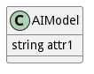

# AIModel

The AIModel is a class within the ams package that provides methods for creating, updating, removing, and adding to AI models, with a specific attribute &#34;attr1&#34; of string type.

## Attributes

* attr1:string - description long description

## Associations

No associations

## Methods

<h2>Method Details</h2>
    

